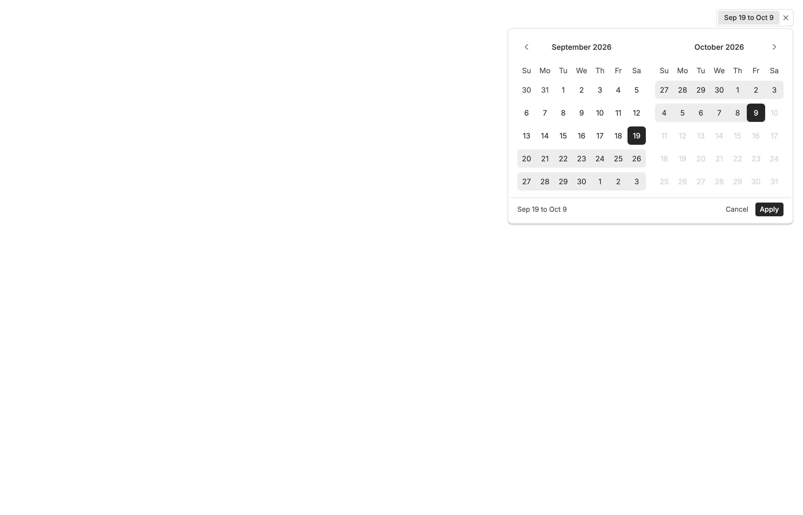
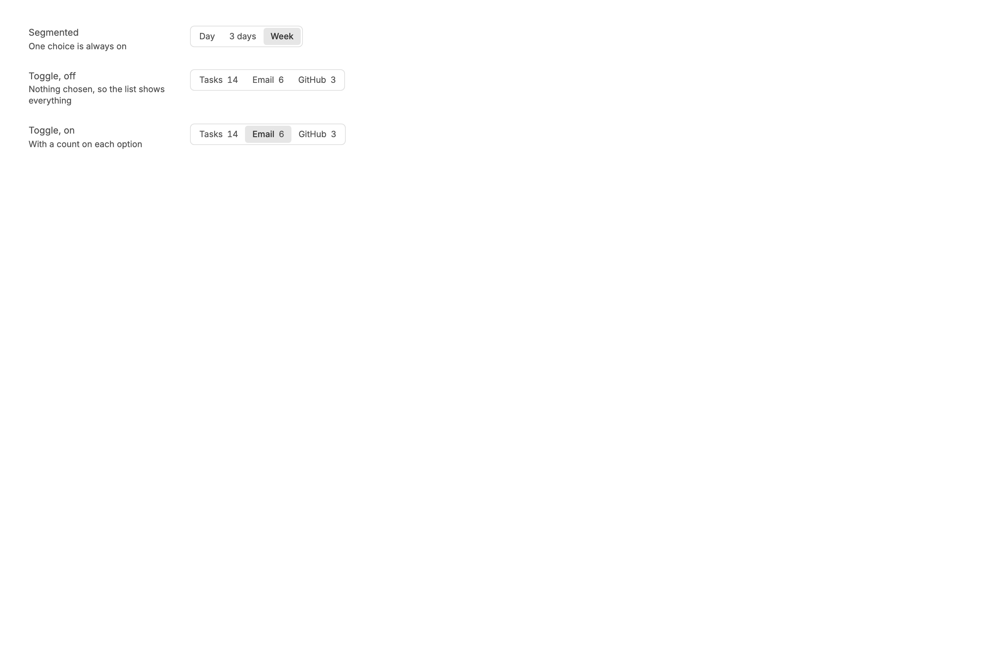
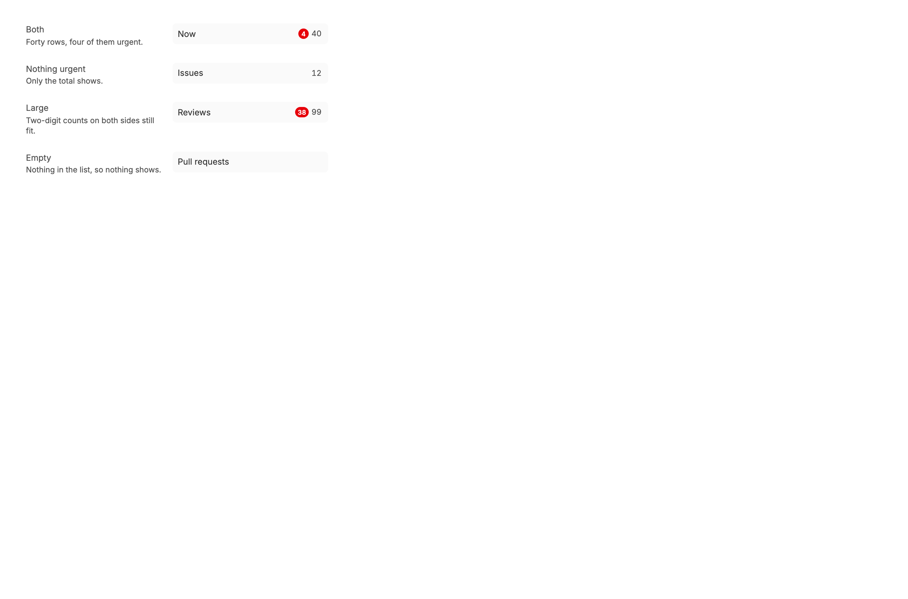
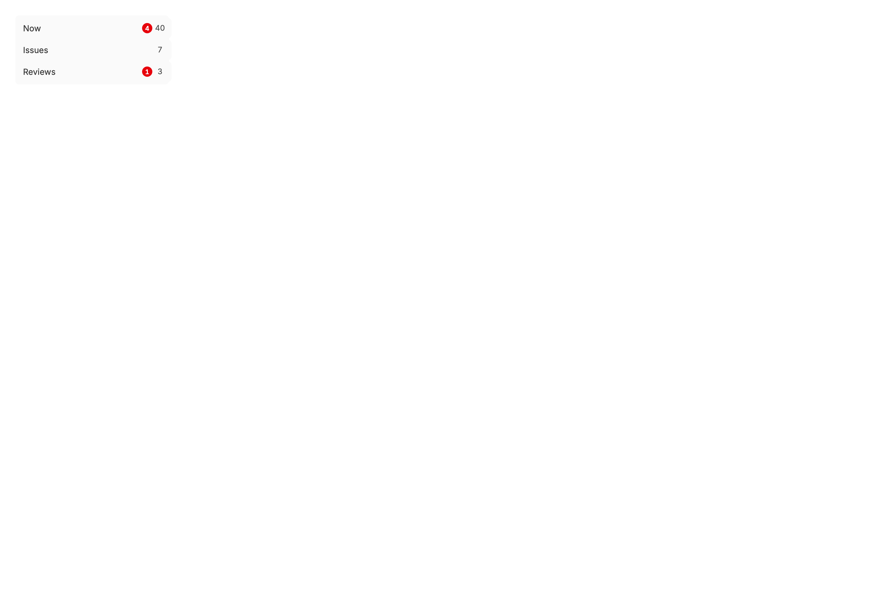
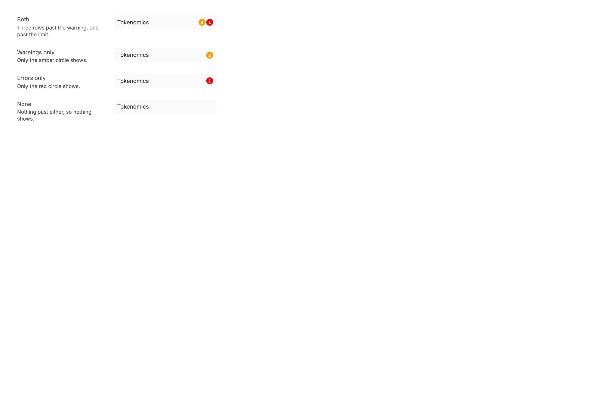
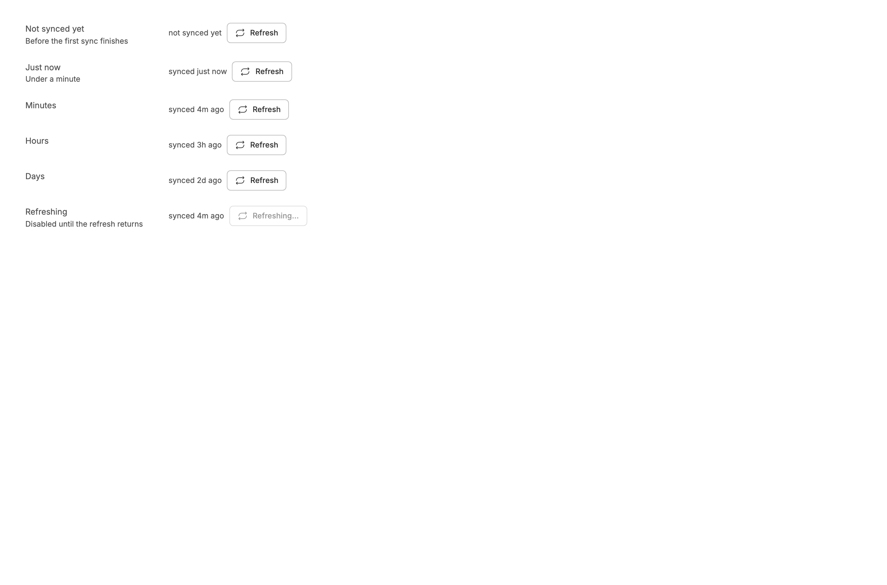
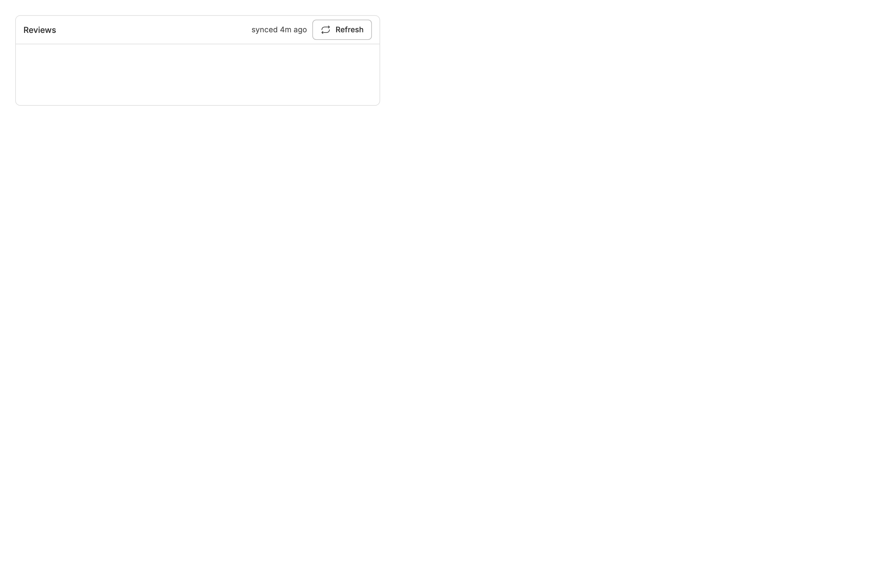
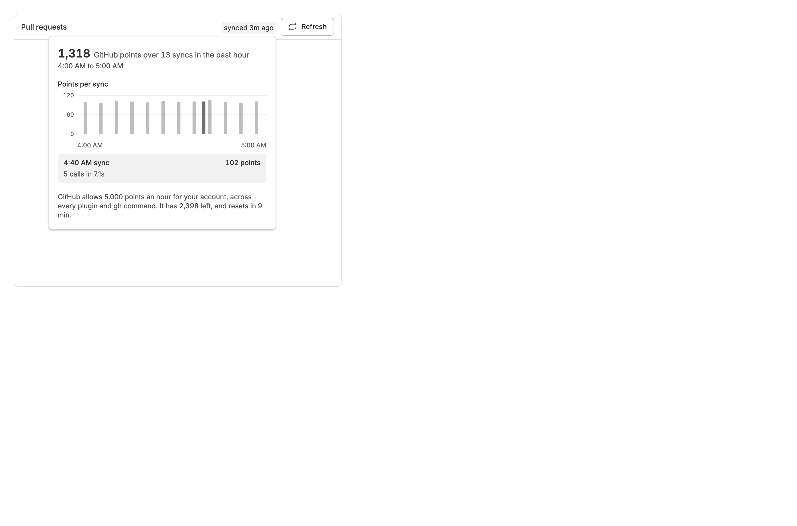
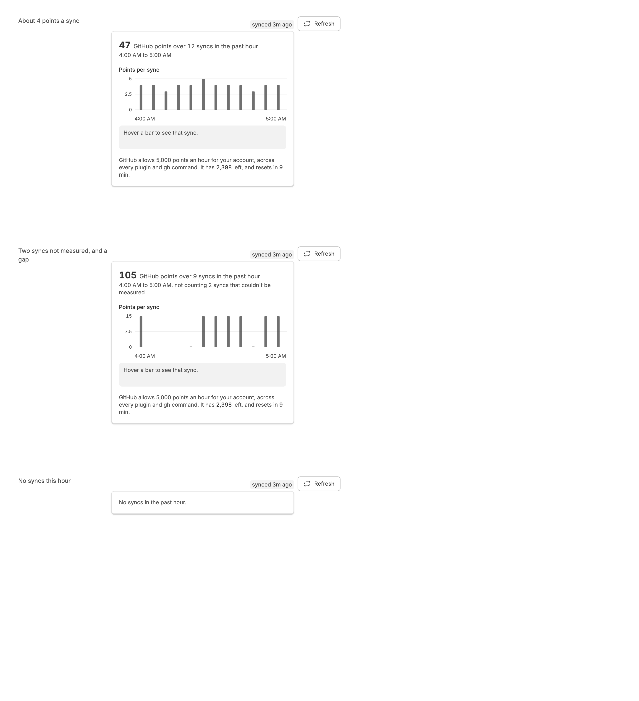
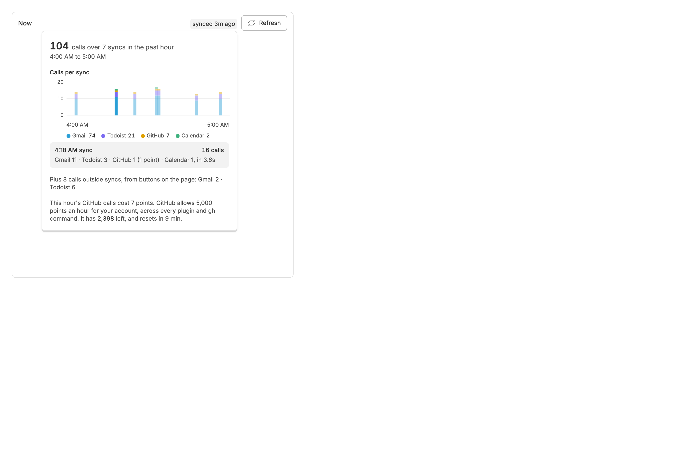

<!-- Written by `npm run screenshots` in bb-plugins. Edit the stories there, not this file. -->

# component-library

UI that several plugins draw the same way, starting with the sync status in a page's title bar.

Source: [`component-library`](https://github.com/danielbachhuber/bb-plugins/tree/main/component-library)

## Date range

### Empty

Closed, with nothing picked: a button the width of its placeholder.

### Picked

Closed, with a range applied: the button names the days it covers, and the cross beside it drops the range.

### Open

Open on a range, two months at a time, with the days outside it disabled.

### Open empty

Open with nothing picked yet, so Apply is still disabled.

## Segmented

### States

Segmented picks one of a few choices, such as a period; one is always on. SegmentedToggle filters a list, and pressing the chosen option again turns the filter off.

## Sidebar count

### States

The counts beside a page's name in the sidebar: the rows that need you most in a red circle, those due today in an amber one when the page counts them, joined into one pill when both show, then every row.

### Aligned

Rows with and without a circle, one above the other: the totals line up because each keeps a box at least 20px wide.

### Levels

Counts of rows past a warning, in amber, and past an error, in red, for a page with no total to show.

## Sync status

### States

Every label the control can show, from no sync yet to days old, and the button while a refresh runs.

### In a title bar

Where the control goes: the right end of a page's title bar, across from its name.

### Usage

Clicking the label opens what the past hour of syncs cost on GitHub: the total, a bar per sync with one hovered, and what the account has left. Here a panel spending about 100 points a sync, with one Refresh between two scheduled syncs.

### Usage states

The summary for a cheap panel, for one with syncs that could not be measured and a gap where none ran, and for an hour with no syncs.

### Usage by service

A plugin that calls several services, as Now does, counts calls rather than GitHub points: each sync's bar stacks its calls by service, the legend gives the hour's total for each, and the calls the page's buttons made between syncs are listed under the chart.

