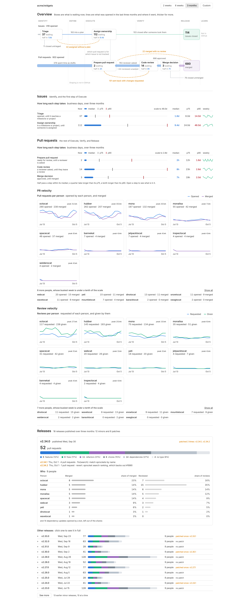
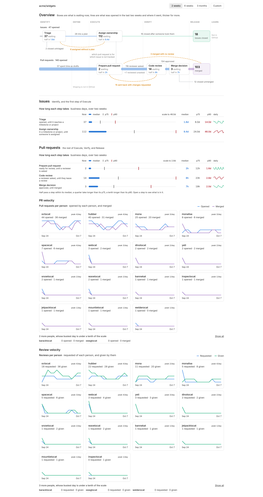
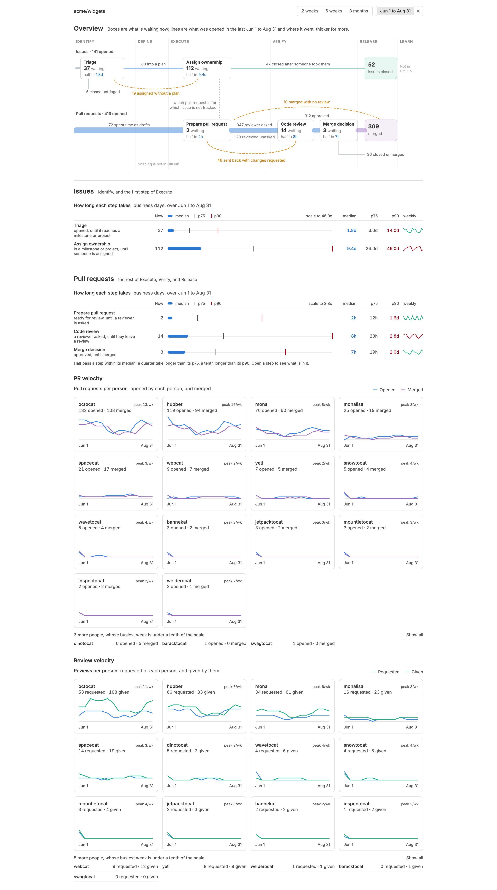
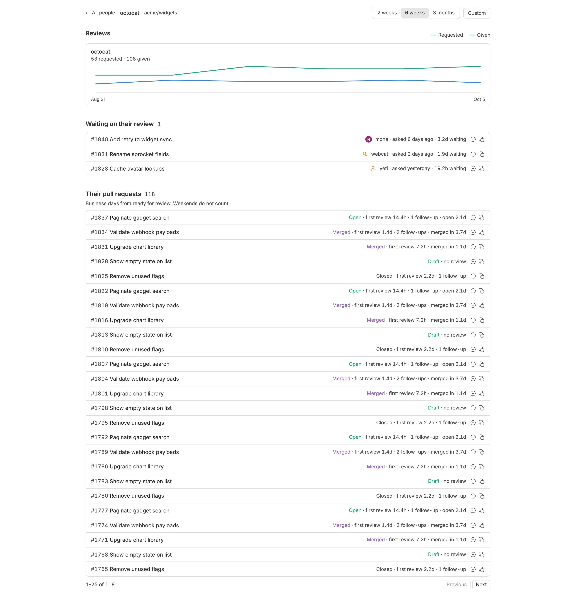
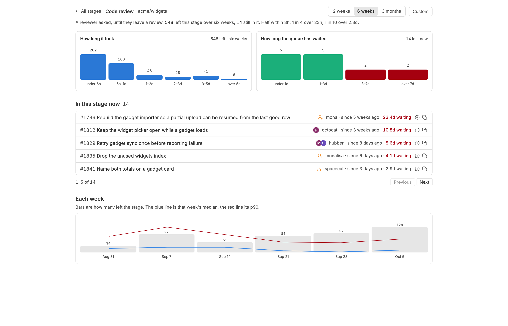
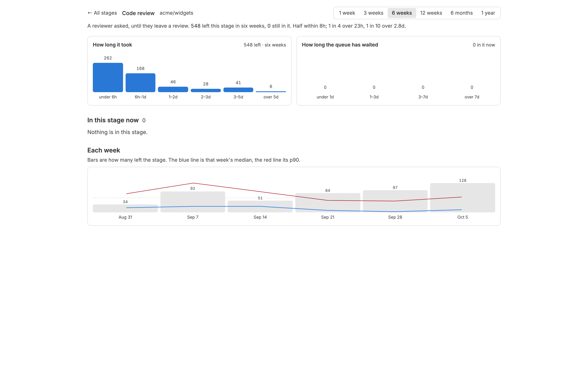
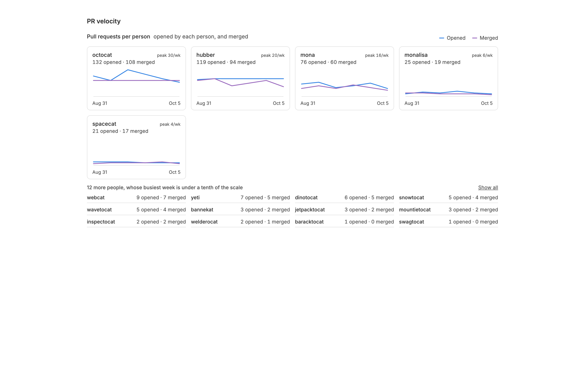
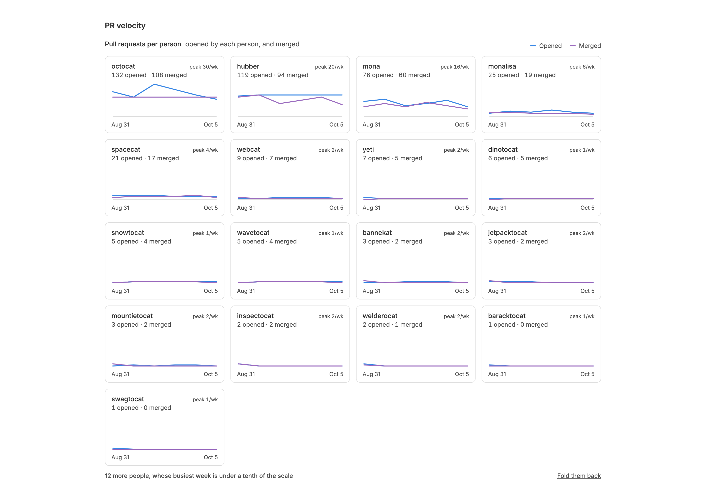
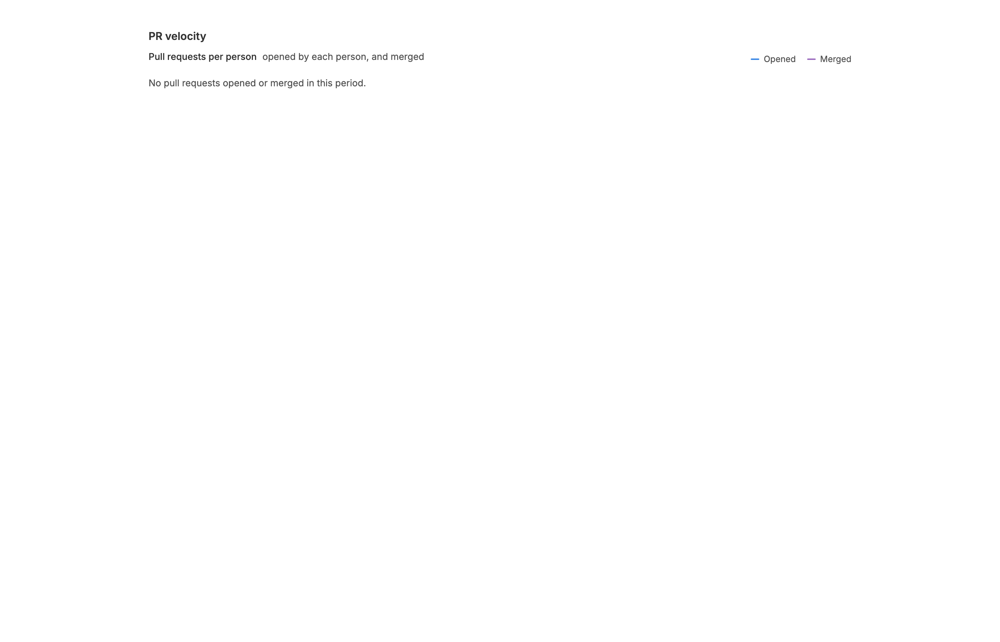

<!-- Written by `npm run screenshots` in bb-plugins. Edit the stories there, not this file. -->

# Contributor Dashboard

A dashboard of how people contribute to one GitHub repository, from a local mirror of its pull requests, reviews and issues. The page opens with the flow of stages work passes through, from Triage and Assign ownership on issues to Implement change, Prepare pull request, Code review and Merge decision on pull requests, each with how many are in it now and the median, p75 and p90 of how long it takes, and clicking a stage lists what is in it, every row naming whoever it is assigned to and offering to start a thread on it or copy its link. Under it, PR Velocity charts for each person the pull requests they opened and the ones that merged, and Review Velocity the reviews requested of them and the reviews they gave, over 2 weeks, 6 weeks, 3 months, or a range of dates you pick, drawn by day, week or month to suit the span, with the quietest people folded into rows of counts. Clicking a name opens that person's page.

Source: [`bb-plugin-contributor-dashboard`](https://github.com/danielbachhuber/bb-plugins/tree/main/bb-plugin-contributor-dashboard)

## Page

### Six weeks

Six weeks, the default: a chart per person in each section, busiest first, and the quiet tail folded into rows of counts.

### Six weeks hovered

Hovering a week shows that week's counts for the person hovered.

### Three months

Three months, the longest preset, drawn by week.

### Two weeks

Two weeks, drawn by day: the shortest preset.

### Custom range

A range someone picked, which no preset covers: a quarter drawn by week, with the dates on the button.

### First sync

The first sync, still reaching back two years; the charts fill in as pages arrive.

### No repository

Before a repository is set.

### Sync failed

A sync that failed, such as gh not being signed in.

### Person page

One person's page, reached by clicking their name on the dashboard.

### Person page paged

A prolific author: their pull requests page 25 at a time.

### Person page quiet

Nobody is waiting on them and they have opened nothing this period.

### Stage page

One stage's page: how long it took, how long the queue has waited, what is in it, and each week.

### Stage page clear

A stage with nothing waiting: the queue chart is empty and the list says so.

## Velocity section

### Folded

The quiet people are rows of counts: a line under a tenth of the scale has no shape to read.

### Show all

Show all draws everyone, on the same scale, however flat that leaves them.

### Empty

Nobody opened anything in the period.

