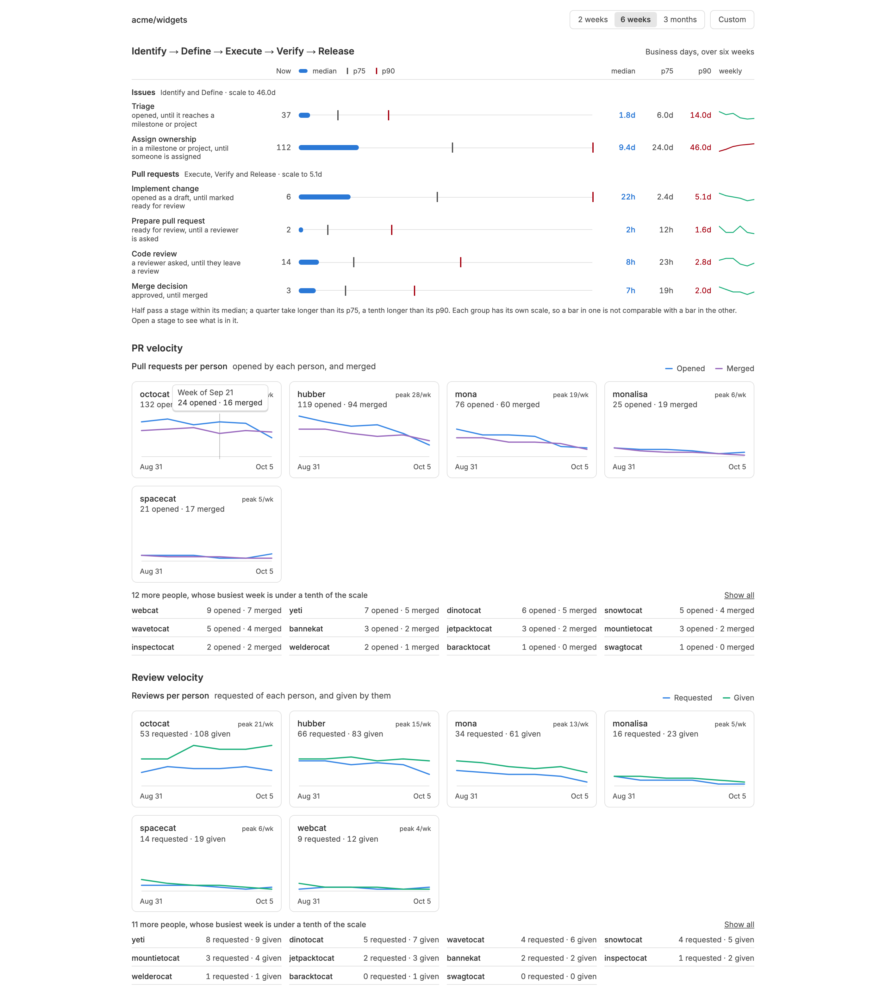
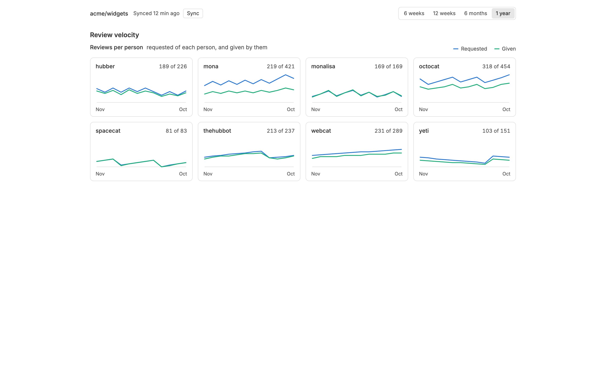
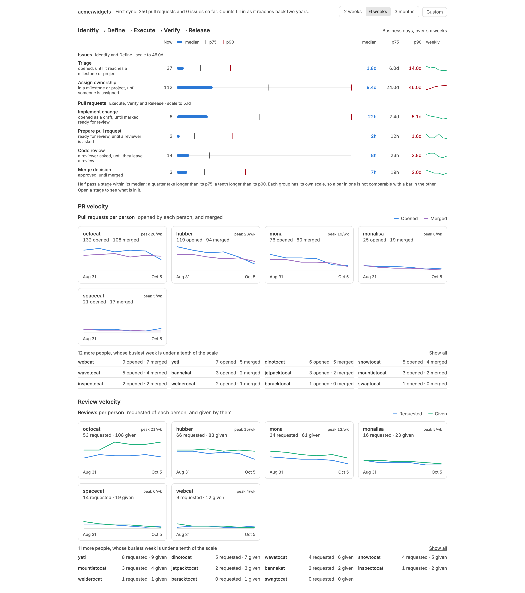
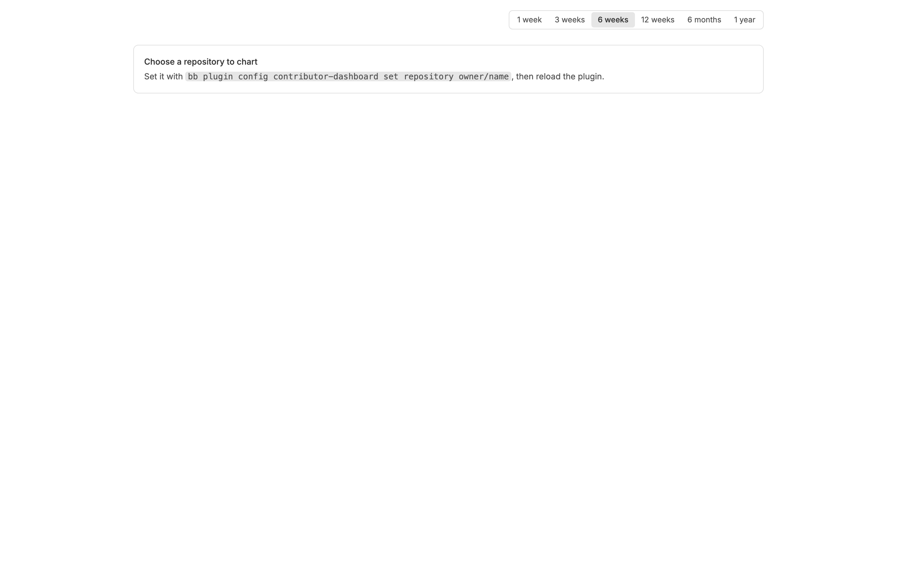
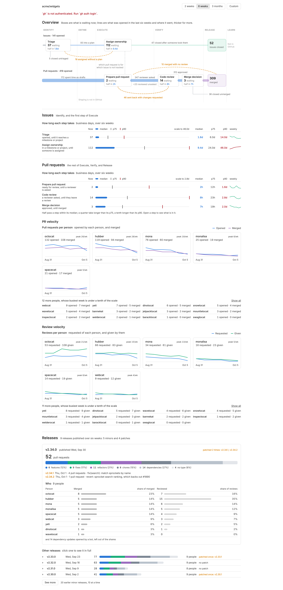
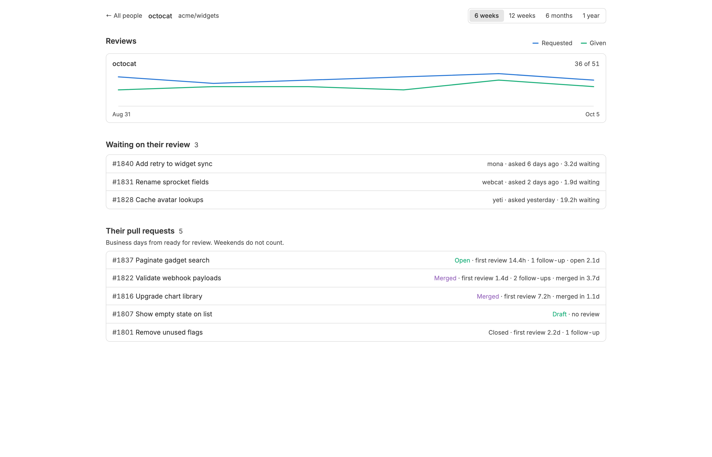
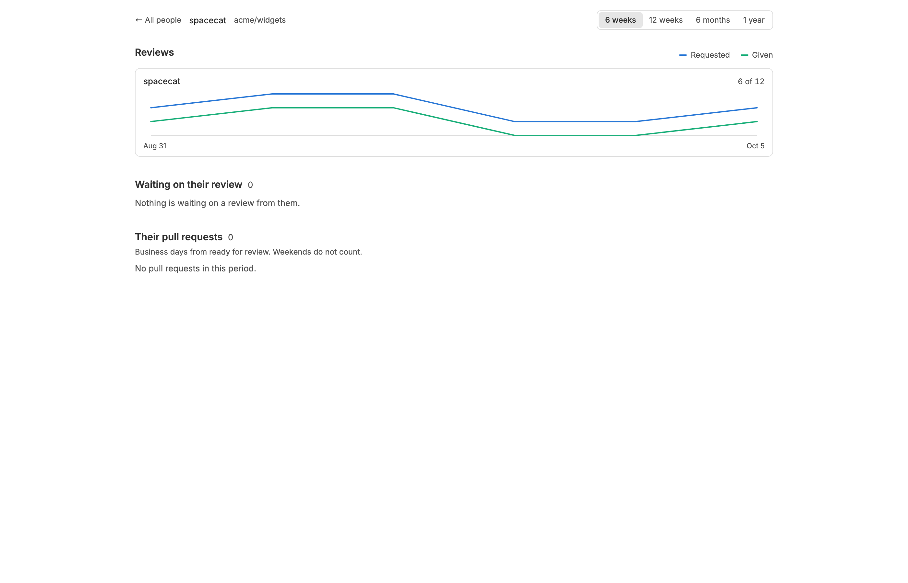

<!-- Written by `npm run screenshots` in bb-plugins. Edit the stories there, not this file. -->

# Contributor Dashboard

A dashboard of how people contribute to one GitHub repository, from a local mirror of its pull requests and reviews. Its first section, Review Velocity, charts for each person the reviews requested of them and the reviews they gave, week by week, over six weeks to a year, and clicking a name opens that person's page: their review lines, the pull requests waiting on their review, and how their own pull requests fared in review.

Source: [`bb-plugin-contributor-dashboard`](https://github.com/danielbachhuber/bb-plugins/tree/main/bb-plugin-contributor-dashboard)

## Page

### Six weeks

Six weeks, the default: one small chart per person, alphabetical, all on one scale.

### Six weeks hovered

Hovering a week shows that week's requested and given counts.

### One year

A year, drawn by month.

### First sync

The first sync, still reaching back two years; the charts fill in as pages arrive.

### No repository

Before a repository is set.

### Sync failed

A sync that failed, such as gh not being signed in.

### Person page

One person's page, reached by clicking their name on the dashboard.

### Person page quiet

Nobody is waiting on them and they have opened nothing this period.

