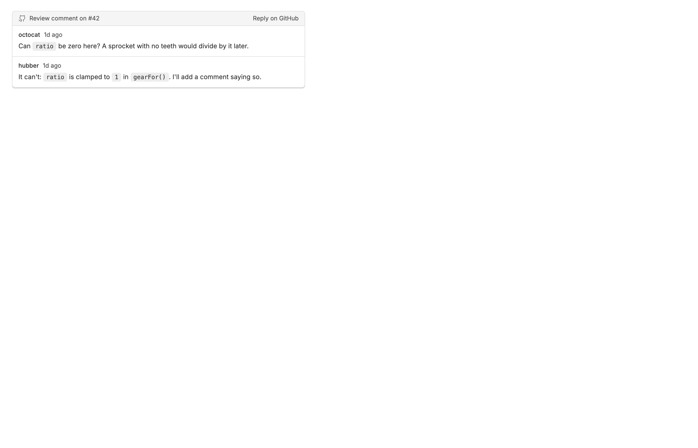
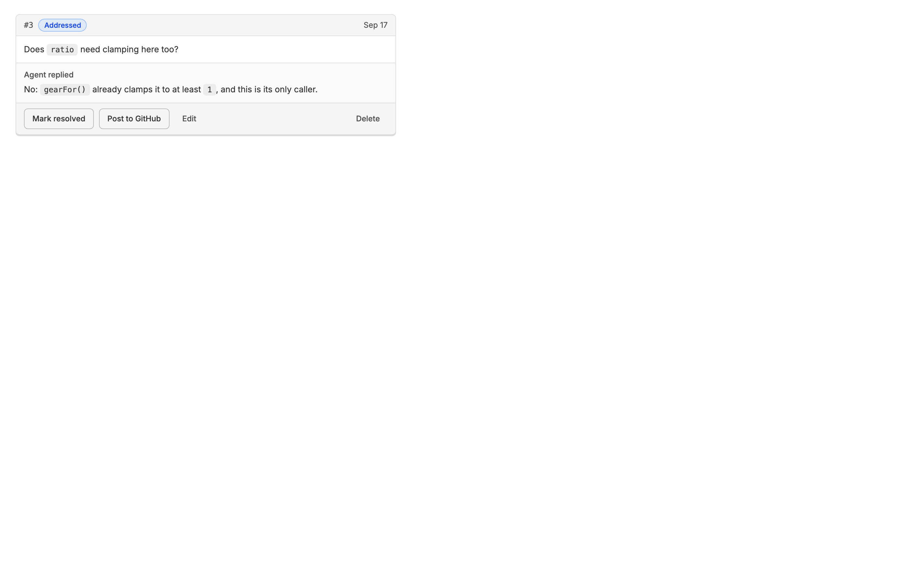

<!-- Written by `npm run screenshots` in bb-plugins. Edit the stories there, not this file. -->

# Diff Comment

Leave review comments inline on a thread's diff, then have the agent work through them one at a time. The agent can offer the points it raises in a review as comments to add, the thread's pull request review comments show on the same diff, and any comment can go to the pull request as a draft review comment.

Source: [`bb-plugin-diff-comment`](https://github.com/danielbachhuber/bb-plugins/tree/main/bb-plugin-diff-comment)

## Github review comments

### Thread on the diff

A review thread on the diff: the comment and its reply, with a link to answer on GitHub.

### Pending draft

A draft on your own unsubmitted review is marked Pending, since only you can see it.

### Panel section

The Diff comments panel lists every unresolved thread on the pull request, including ones the diff cannot show: outdated threads and comments on a whole file.

### Composer with pull request

With a pull request, a comment can go to GitHub as a draft on your pending review instead of staying local.

### Composer without pull request

Without a pull request the GitHub button stays visible but disabled; its tooltip says why.

### Answered comment to post

Once the agent answers a local question, Post to GitHub shares the question and the answer as one draft review comment.

