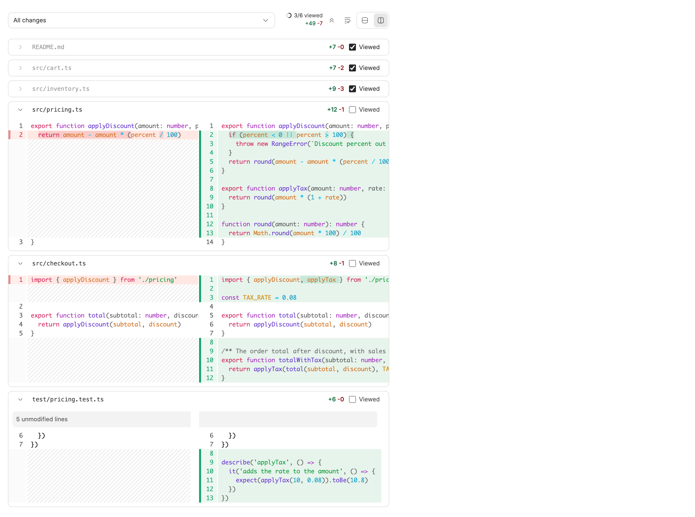
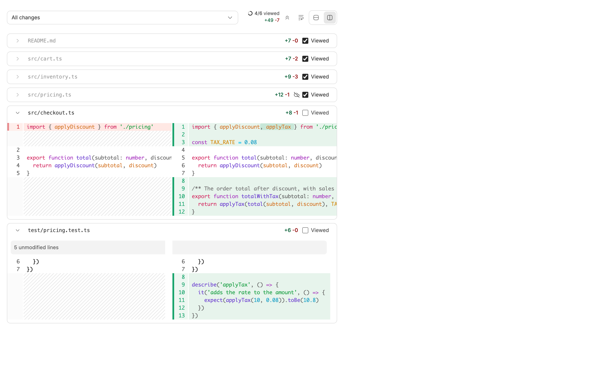
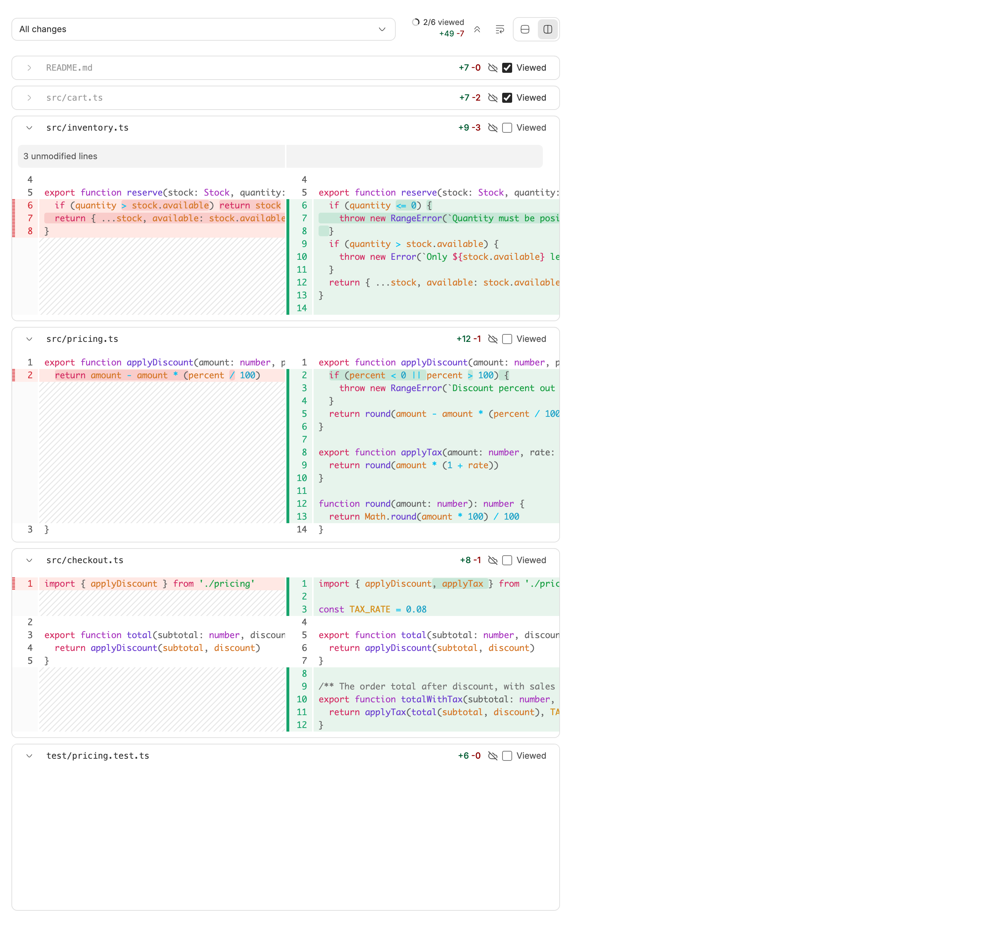

<!-- Written by `npm run screenshots` in bb-plugins. Edit the stories there, not this file. -->

# Diff Viewed

Adds a Viewed checkbox to each file in the changes panel, so a reviewed file collapses, dims, and stays that way until its diff changes, with a count of files viewed so far, an Only unviewed filter that hides reviewed files, and two-way sync with GitHub's Viewed boxes on the thread's pull request, which marks a file viewed on GitHub once you push the diff you marked in bb.

Source: [`bb-plugin-diff-viewed`](https://github.com/danielbachhuber/bb-plugins/tree/main/bb-plugin-diff-viewed)

## Changes panel

### Viewed

Three files marked viewed fold away and dim, the unread file below them stays open, and the toolbar counts 3/6 viewed. Every file here syncs with the pull request, so none shows the Local icon.

### Local

src/pricing.ts has edits that are not pushed, so its diff here differs from the pull request's. Its Viewed mark is Local, shown by the crossed-out cloud before the checkbox, and stays in bb until a push makes the diffs match.

### No pull request

A thread with no open pull request: every mark is Local, checked or not, and goes to GitHub once a pull request with the same diff is opened.

### Loading

While GitHub is still answering: bb's own marks show at once, a spinner holds the Local icon's place, and the viewed count stays muted.

