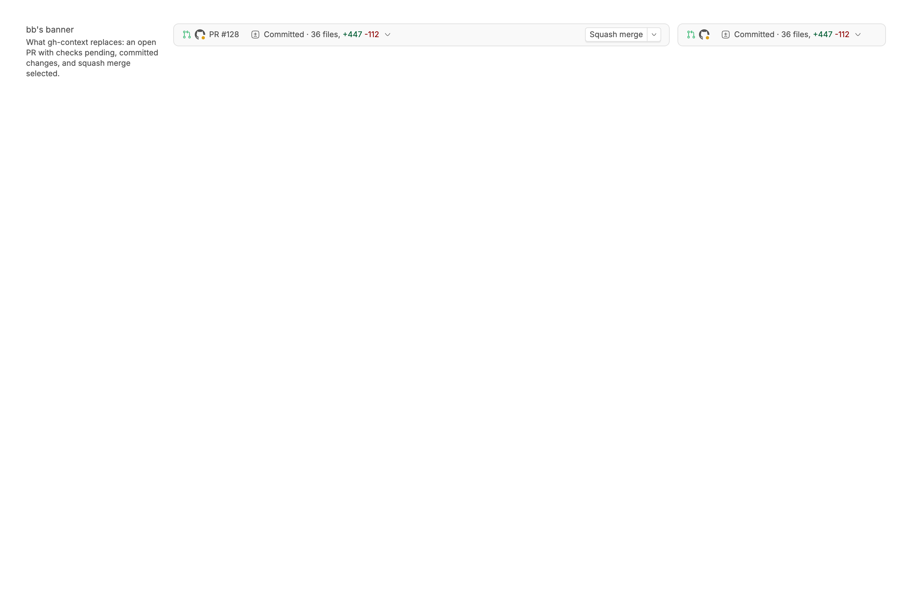
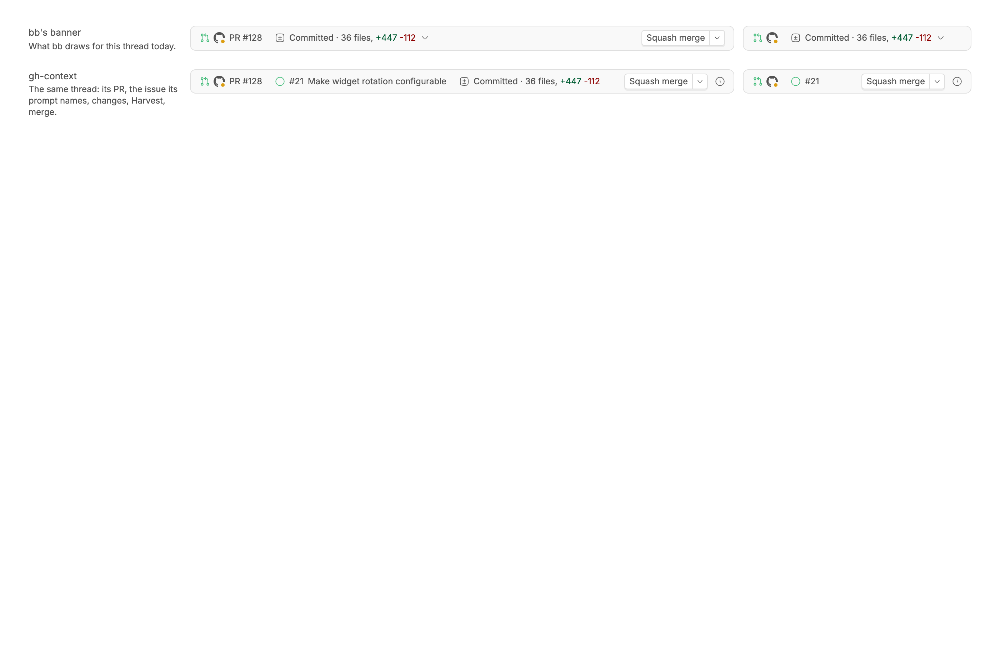
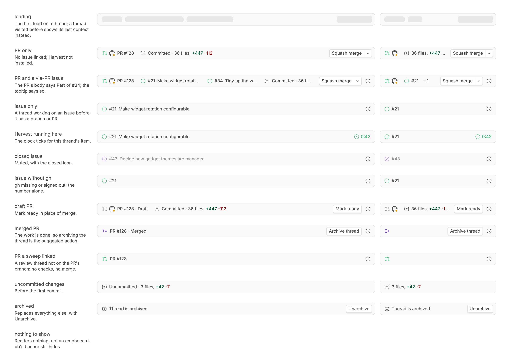
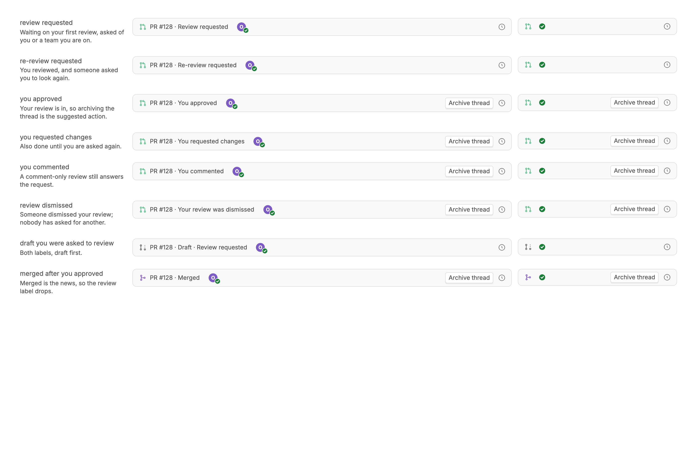
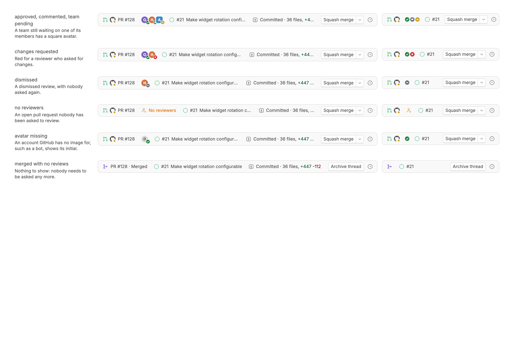

<!-- Written by `npm run screenshots` in bb-plugins. Edit the stories there, not this file. -->

# GitHub Context

A banner above the composer showing the thread's pull request and its reviewers, the GitHub issues it works on, its changes, and a Harvest timer, in place of bb's own.

Source: [`bb-plugin-gh-context`](https://github.com/danielbachhuber/bb-plugins/tree/main/bb-plugin-gh-context)

## Banner

### Default

### Comparison

### States

### Review states

### Reviewers

The pull request's reviewers, right after it: each avatar carries a badge for where that review stands. Hovering an avatar names the reviewer and their review.

