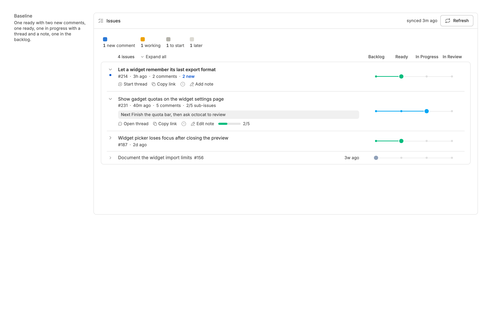
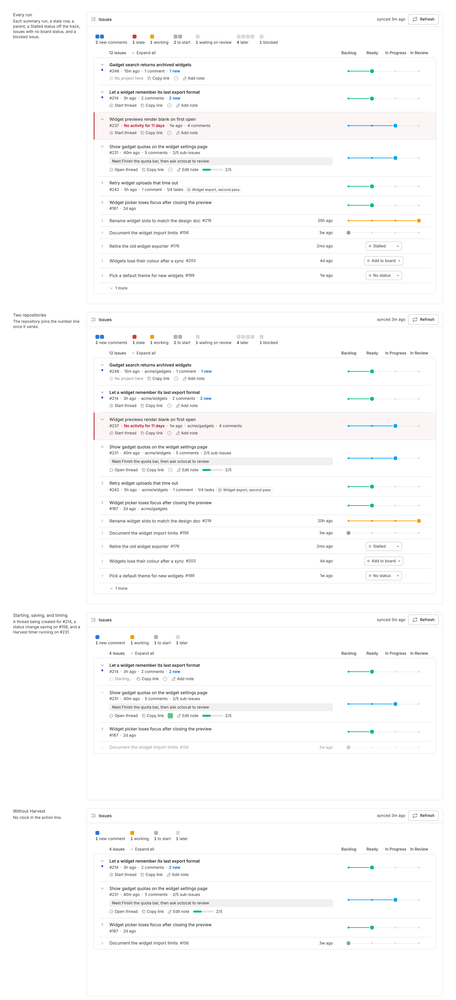
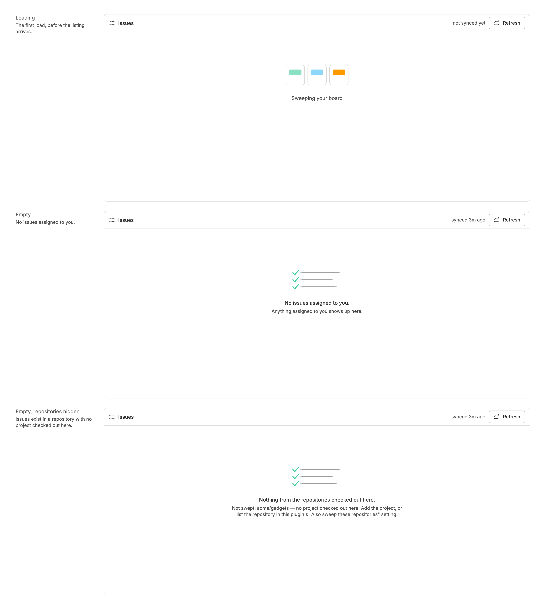
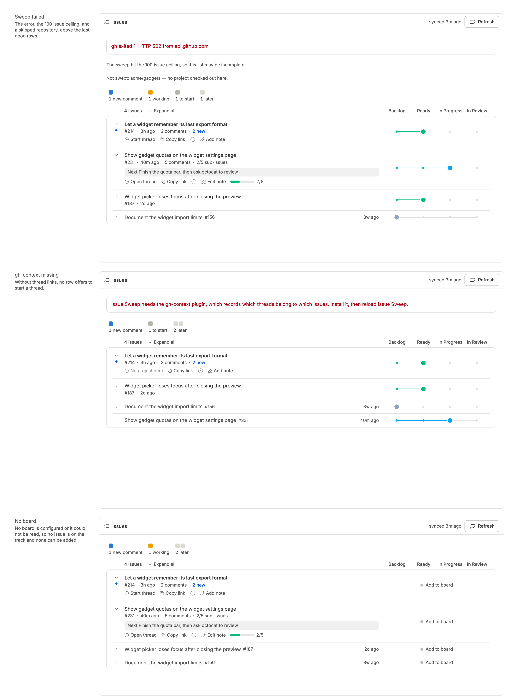
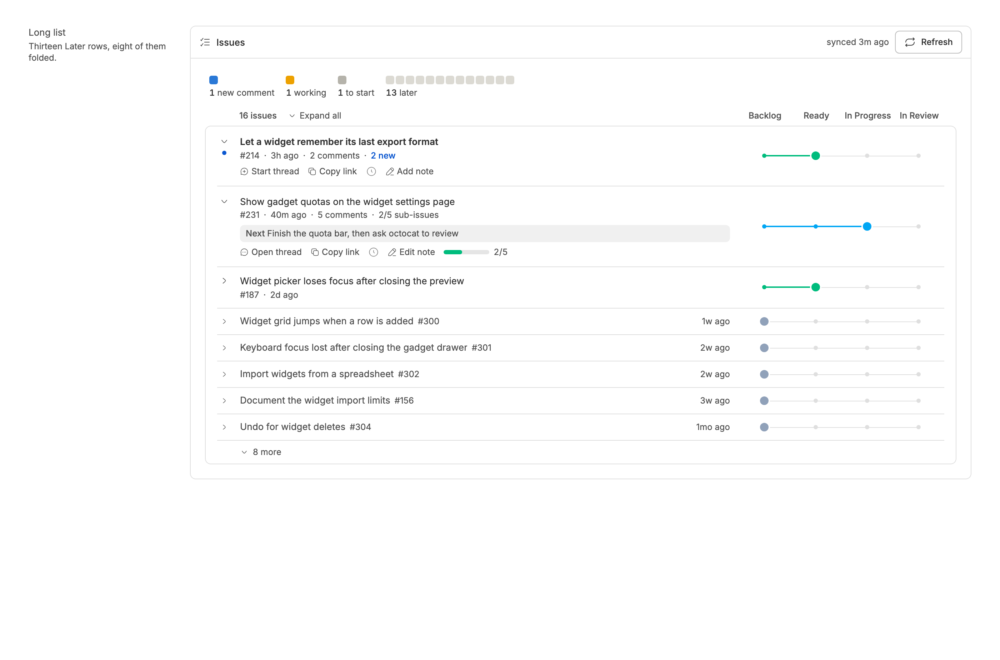

<!-- Written by `npm run screenshots` in bb-plugins. Edit the stories there, not this file. -->

# Issue Sweep

Open GitHub issues assigned to you in one list, ordered Now, Next, and Later by what needs you, with local notes and new comment counts. Needs gh-context.

Source: [`bb-plugin-issue-sweep`](https://github.com/danielbachhuber/bb-plugins/tree/main/bb-plugin-issue-sweep)

## Issue list

### Baseline

Four issues assigned to you. The one with new comments and the one with a thread are open at the top; the ready one is closed to its number line; the backlog one is a single dimmed line.

### Rows

Every run the list can draw: new comments, stale, and working in Now; to start in Next; then waiting on review, later, and blocked. Rows show a parent chip, sub-issue and task counts, a status the track does not name, issues off the board, and "No project here" where nothing is checked out. Then the same list across two repositories, a thread being started with a timer running, and the panel without Harvest.

### States

The panel before the first listing arrives, with nothing assigned, and with nothing visible because the only repository with issues has no project on this machine.

### Warnings

What the panel shows when something is wrong: a failed sweep above the last good rows, gh-context missing so no row can start a thread, and no board configured so every row shows its status as text in place of the track.

### Long list

A long list: the Now and Next rows at the top, then the first five Later rows, with the rest folded into "N more".

