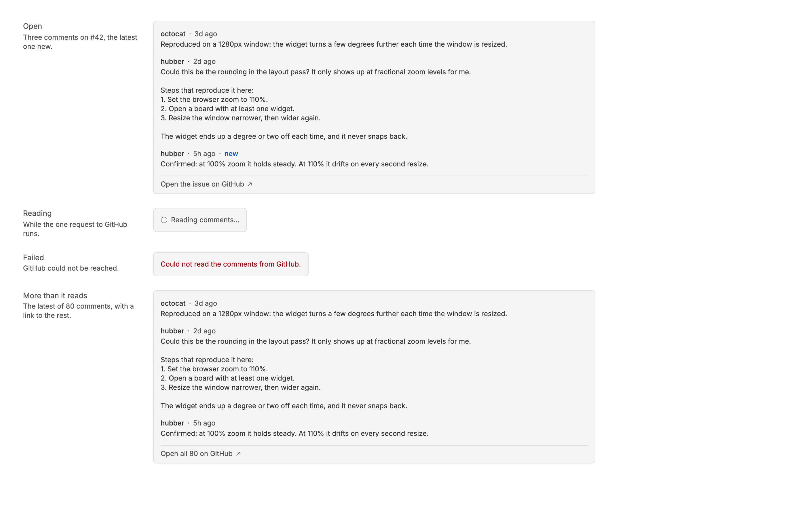

<!-- Written by `npm run screenshots` in bb-plugins. Edit the stories there, not this file. -->

# Issue Sweep

Open GitHub issues assigned to you, split into what needs you and everything else grouped by board status, with local notes, an On hold box that sinks an issue to the bottom, new comment counts, and the comments a click away. Needs gh-context.

Source: [`bb-plugin-issue-sweep`](https://github.com/danielbachhuber/bb-plugins/tree/main/bb-plugin-issue-sweep)

## Issue list

### Baseline

Four issues assigned to you. The one with new comments, the one with a thread, and the ready one need you, open on the left; the backlog one is a single line on the right.

### Rows

Every run the list can draw: new comments, stale, working, and to start under Needs you, then two issues on hold at its bottom, one with a note and one without; waiting on review, later, and blocked grouped by status beside them. Rows show a parent chip, sub-issue and task counts, a status the stages do not name, issues off the board, and "No project here" where nothing is checked out. Then the same list across two repositories, a thread being started with a timer running, and the panel without Harvest.

### States

The panel before the first listing arrives, with nothing assigned, and with nothing visible because the only repository with issues has no project on this machine.

### Warnings

What the panel shows when something is wrong: a failed sweep above the last good rows, gh-context missing so no row can start a thread, and no board configured so every row shows its status as text in place of the picker.

### Comments drawer states

The drawer a row's comment count opens: the issue's latest comments, oldest first, with the ones that arrived since it was last seen marked new. Each opens on GitHub. Then the drawer while it reads, when GitHub fails, and when the issue has more comments than the drawer reads.

### Long list

A long list: what needs you on the left, and a long backlog grouped on the right, with the issues off the board after it.

