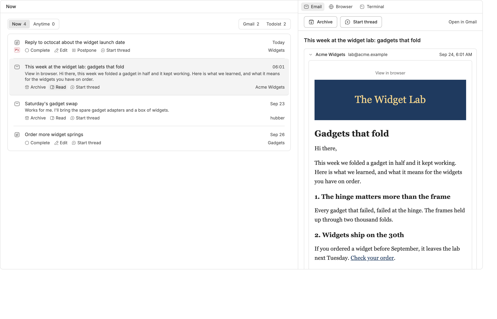
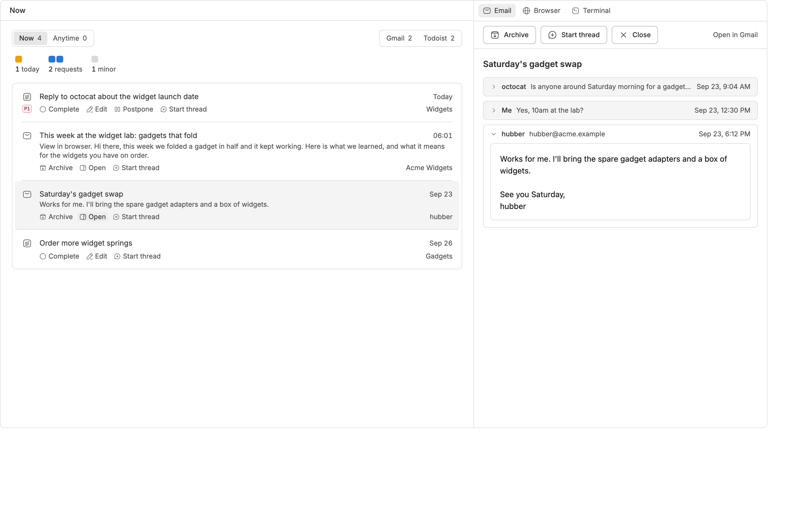
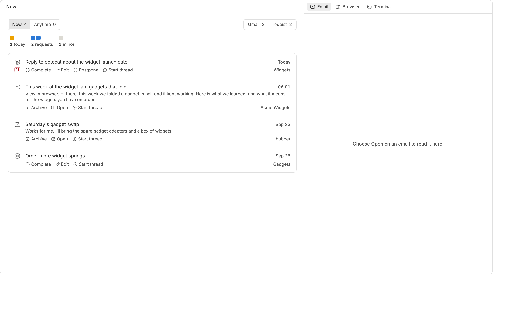
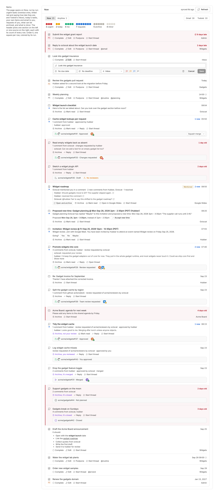
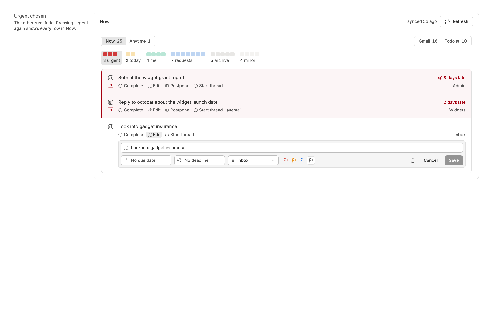
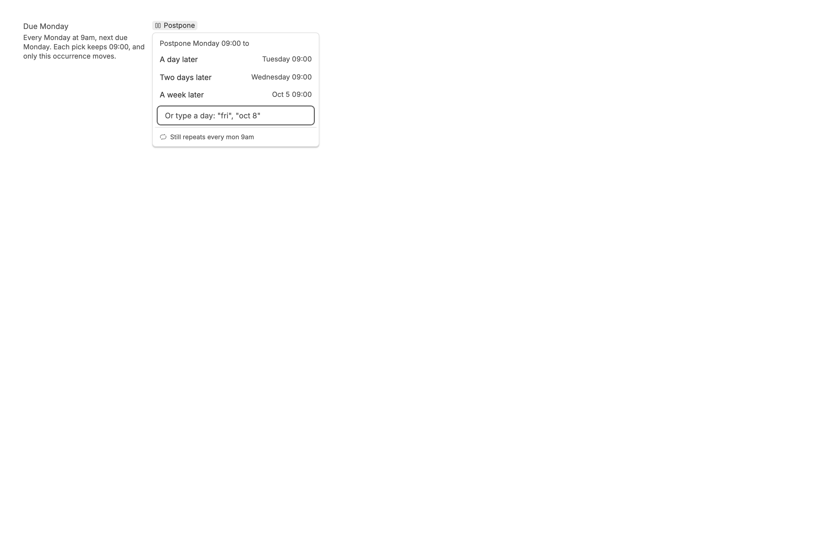
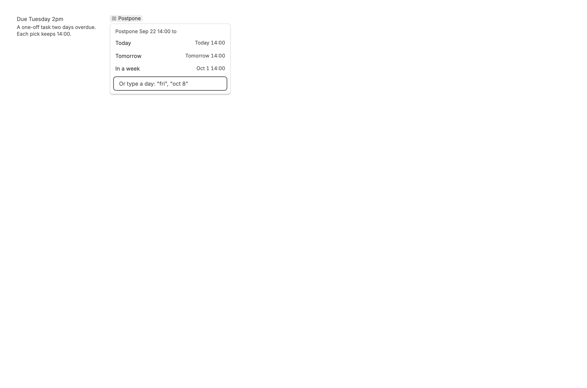
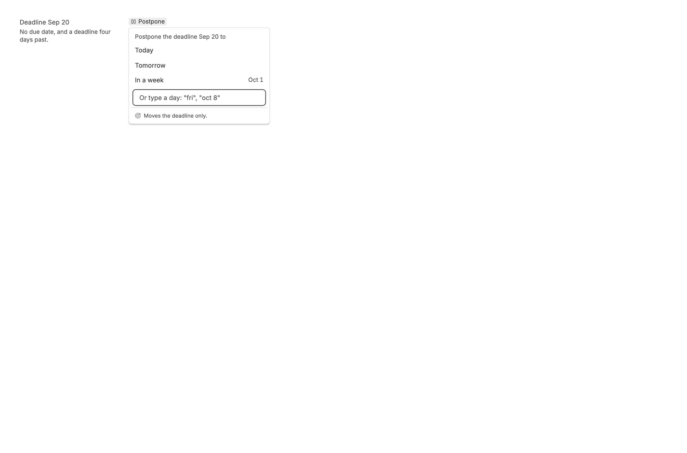
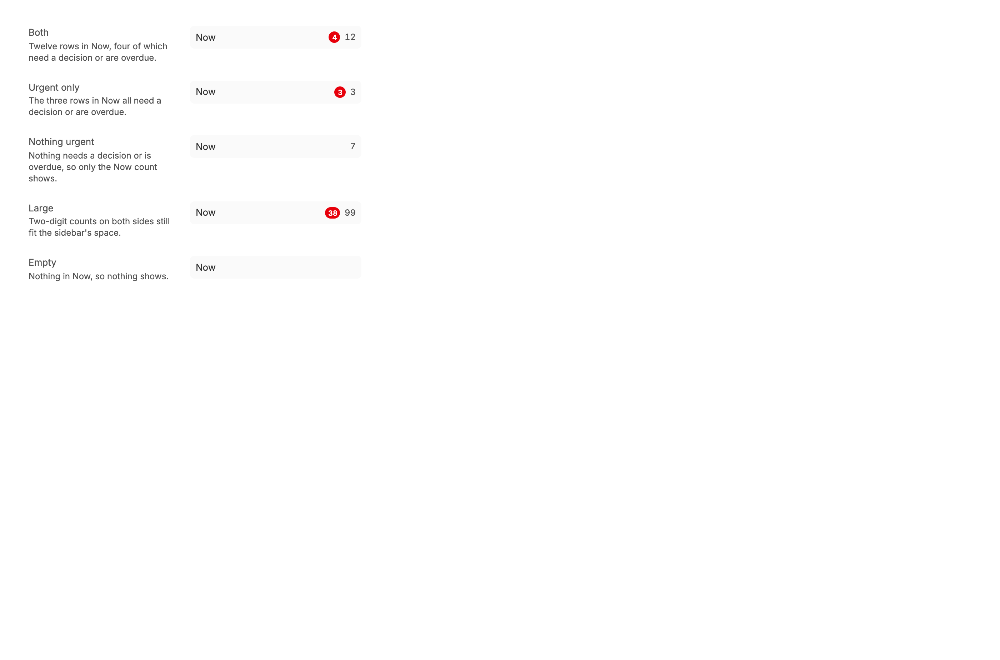

<!-- Written by `npm run screenshots` in bb-plugins. Edit the stories there, not this file. -->

# Now

One list of what needs doing now, from Todoist and your Gmail inbox, with GitHub notifications gathered per pull request or issue, showing each pull request's reviewers, and Google Docs comments per document. Overdue tasks, and mail left in the inbox more than a day, are tinted red and say how late they are. A square per row above the list shows how Now splits into urgent (overdue tasks and Todoist's Inbox), unread email, today, your own items and email to you, requests of you, what can be archived, and what is minor, and pressing a run shows only its rows. Todoist descriptions render as Markdown, with open subtasks listed beneath. Complete, rename, reschedule, postpone, reprioritize, move, or delete tasks, read an email in full beside the list, open an email or GitHub comment the snippet cut short in full, archive email or mark it read, answer calendar invitations, accept a new time a guest proposes for your event, reply on GitHub, merge your own pull requests, and start a thread from any row.

Source: [`bb-plugin-now`](https://github.com/danielbachhuber/bb-plugins/tree/main/bb-plugin-now)

## Email reader

### Newsletter

Open on a newsletter opens it in the Email tab beside the list, laid out as its sender wrote it, and marks it read. The row being read is highlighted.

### Conversation

A thread of several messages shows the latest open and the earlier ones one line each, which open when clicked.

### Empty

The Email tab before any email is opened in it.

## Item list

### Default

### Filtered to a run

Pressing a run of squares under the toggles shows only its rows: here, the urgent ones.

### Sections

Anytime, each source on its own, and both sections stacked.

### States

## Postpone menu

### Open

The menu Postpone opens on a recurring task: quick picks counted from its date, a box for any later day, and the rule it keeps.

### Overdue date

On a one-off task whose due date has passed, Postpone moves that date and keeps its time. Today comes first, since the date has passed.

### Past deadline

On a task with no due date and a deadline that has passed, Postpone moves the deadline.

## Sidebar counts

### Default

The counts beside Now in the sidebar: urgent rows (overdue tasks and Todoist's Inbox) in a red circle, then every row in the Now section, as its tab counts them.

