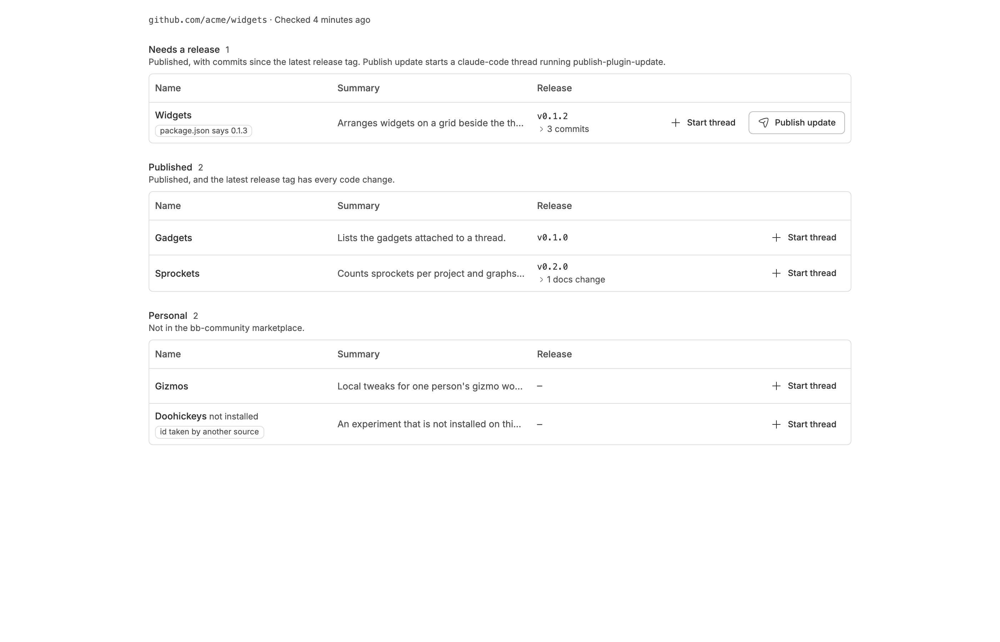
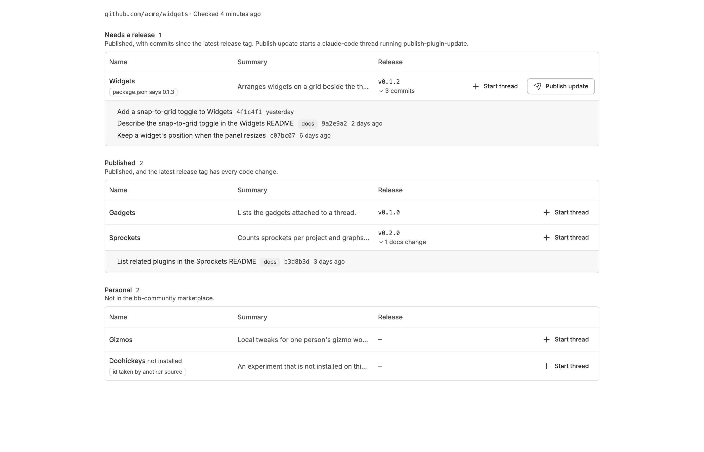
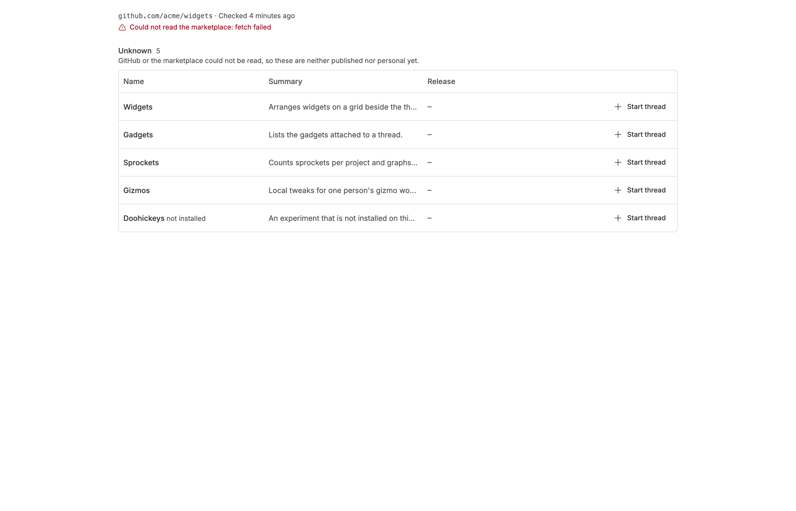

<!-- Written by `npm run screenshots` in bb-plugins. Edit the stories there, not this file. -->

# Plugin Shelf

Lists the plugins in your bb-plugins checkout as published and current, published with commits not yet released (with those commits), or personal, on a My plugins page in bb's Plugins screen, with a button on each to start a thread on it and one to publish an update where one is due.

Source: [`bb-plugin-plugin-shelf`](https://github.com/danielbachhuber/bb-plugins/tree/main/bb-plugin-plugin-shelf)

## Shelf

### Mixed

Every plugin in a checkout, grouped by whether it needs a release, each with a Start thread button. Widgets has three commits since its last release tag, and its package.json was bumped without a tag.

### Commits open

A plugin's unreleased commits, opened from its row. The README change is marked as docs, and each short SHA links to the commit.

### Marketplace unreachable

The marketplace could not be read, so no plugin is called personal and the page says why.

### No checkout

Plugin Shelf installed from a folder that is not a plugin checkout.

