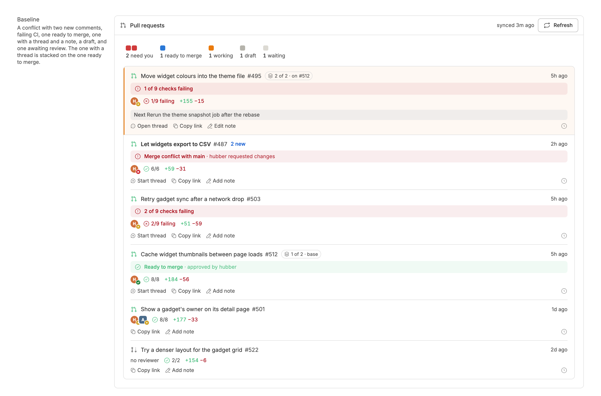

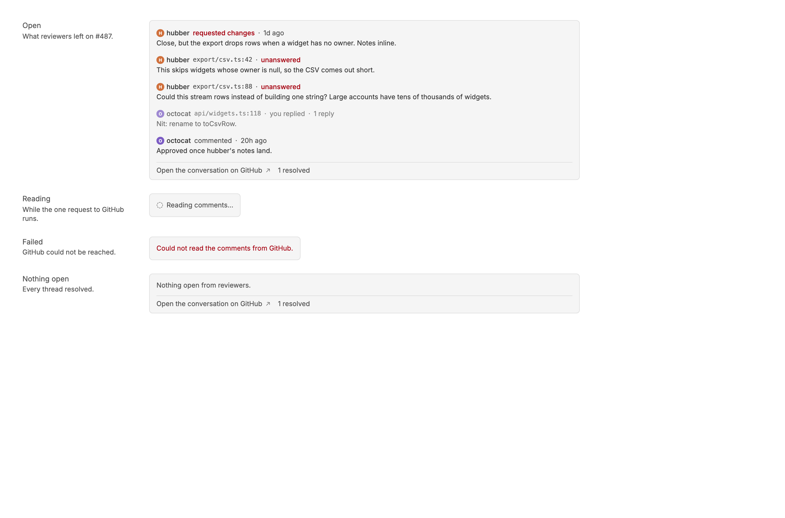
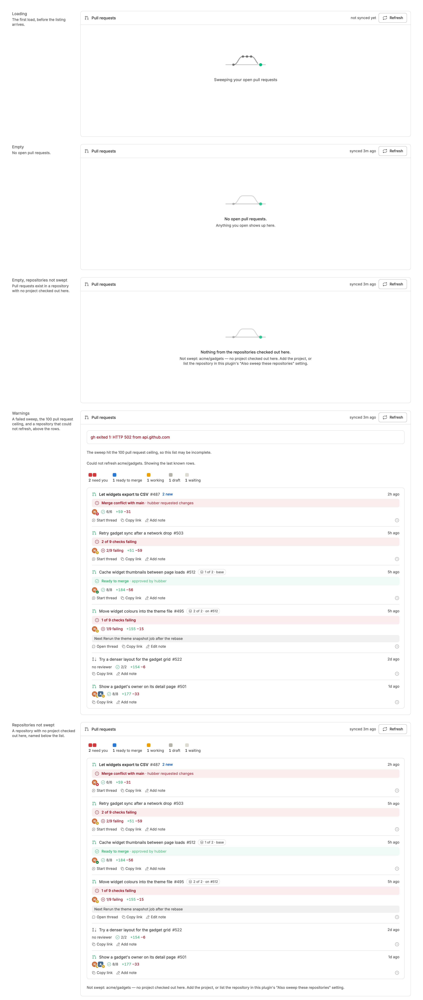
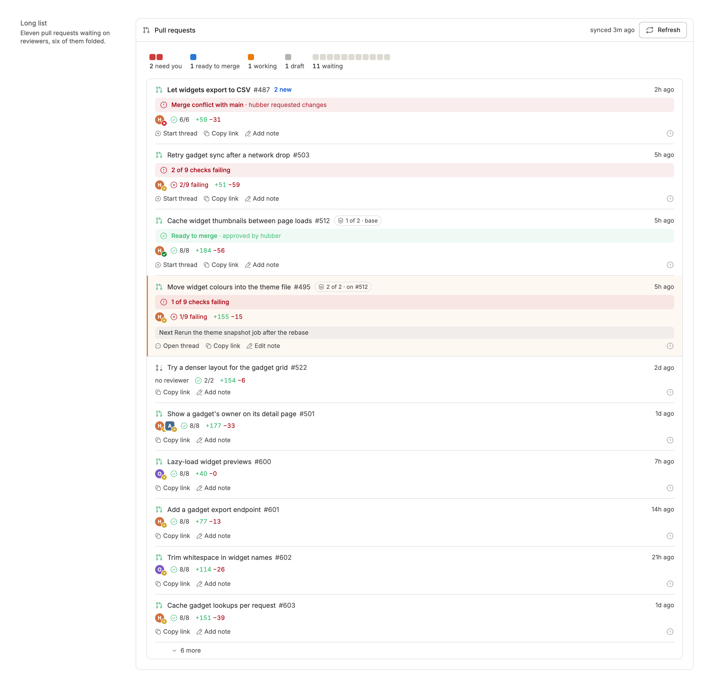

<!-- Written by `npm run screenshots` in bb-plugins. Edit the stories there, not this file. -->

# PR Sweep

Open pull requests you authored in one list, newest first with the overdue and in-progress ones pinned on top, with local notes, new comment counts, review comments a click away, a Dismiss for failing checks you cannot fix, and where a stacked pull request sits in its stack. Needs gh-context.

Source: [`bb-plugin-pr-sweep`](https://github.com/danielbachhuber/bb-plugins/tree/main/bb-plugin-pr-sweep)

## Pr list

### Baseline

A typical day. The one with a thread is pinned at the top; the rest follow newest first, each with a red banner naming what stops it or a green one when it can merge. The one with a thread is stacked on the one ready to merge, so each has a chip: "1 of 2 · base" and "2 of 2 · on #512".

### Rows

Every run the list can draw: needs you, ready to merge, working, drafts, and waiting, including one stale after six days with its reviewer, pinned on top with the one being worked on, and the rest newest first. Then every flag in the banner, the list across two repositories, a thread being started with a timer running, and the panel without Harvest.

### Comments drawer

The drawer a row's comment count opens. The review that requested changes comes first, then the threads still open, unanswered ones marked in red, then general comments. Resolved threads wait behind "1 resolved". Each entry opens on GitHub. Then the drawer while it reads, when GitHub fails, and with nothing open.

### States

Loading, empty, and the notices the panel shows above and below its rows.

### Long list

A long list: the pinned rows at the top, then every other pull request newest first, with nothing folded.

