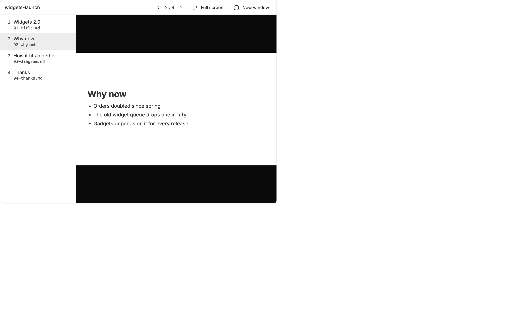
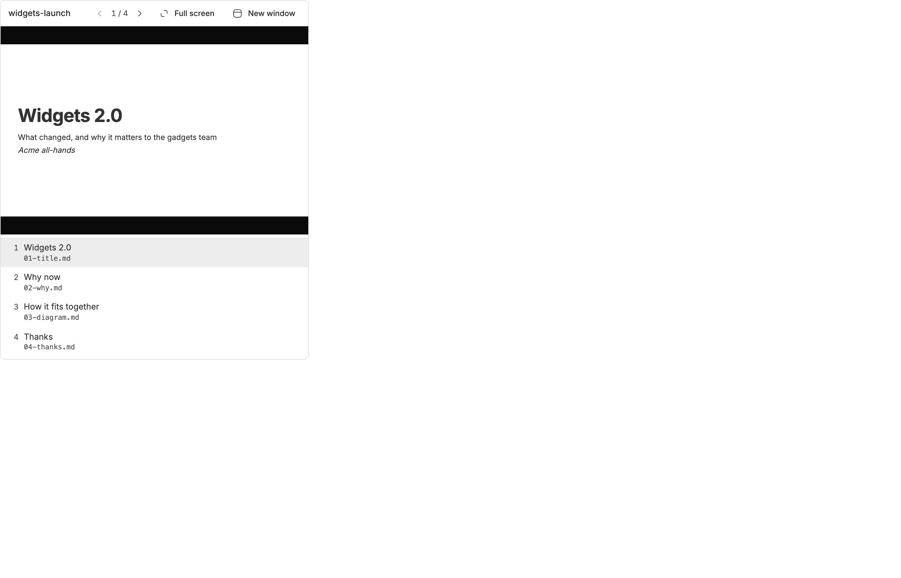
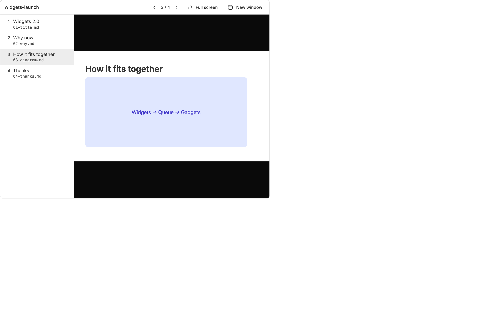
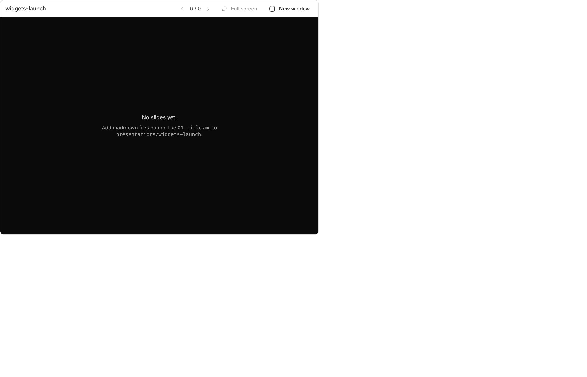
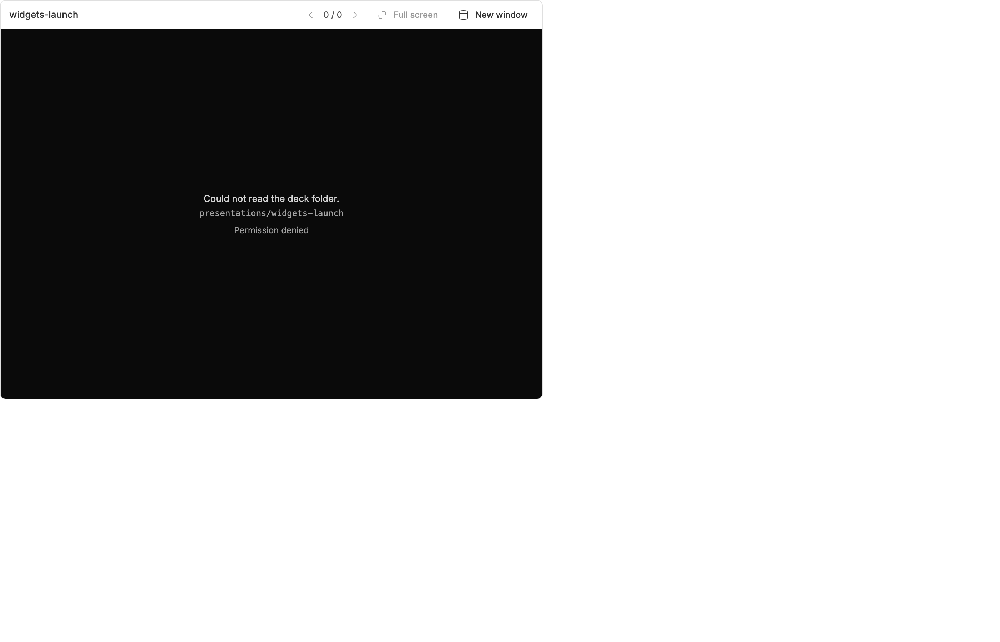
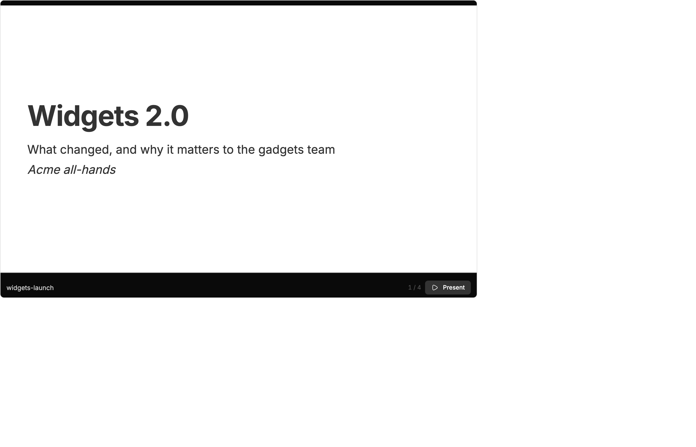

<!-- Written by `npm run screenshots` in bb-plugins. Edit the stories there, not this file. -->

# Presentations

Give a talk from a bb thread. Start a presentation from the Presentations page, and the thread writes its slides as numbered markdown files in one folder. A Present button in the thread header shows them in a panel beside the chat, with each slide file listed for editing, a full-screen mode, and a separate window for the projector. Slides reload as the agent edits them.

Source: [`bb-plugin-presentations`](https://github.com/danielbachhuber/bb-plugins/tree/main/bb-plugin-presentations)

## Deck

### Panel wide

The Slides panel beside a thread: the slide files on the left, the current slide on the right.

### Panel narrow

In a narrow panel the slide files move below the slide.

### Panel image

A slide with an image from the deck folder.

### Panel empty

A deck whose folder has no numbered slides yet.

### Panel problem

A deck folder that could not be read.

### Window

The deck alone, as the New window button opens it. Present takes it full screen.

