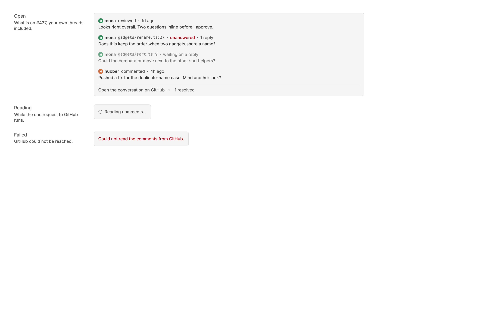
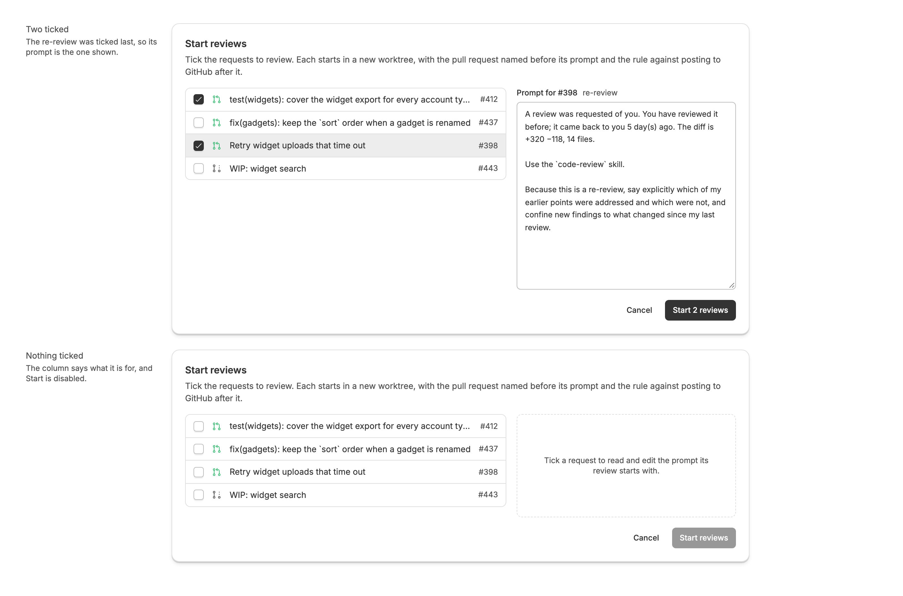

<!-- Written by `npm run screenshots` in bb-plugins. Edit the stories there, not this file. -->

# Review Sweep

Open pull requests waiting on a review from you in one list, ordered Now, Next, and Later by what needs you, oldest request first, with local notes, new comment counts, comments a click away, and where a stacked pull request sits in its stack, plus Batch to start reviews for several at once. Needs gh-context.

Source: [`bb-plugin-review-sweep`](https://github.com/danielbachhuber/bb-plugins/tree/main/bb-plugin-review-sweep)

## Review list

### Baseline

A typical day. The one waited on too long, with its red banner, and the one with a thread at the top; then the fresh request, with two new comments.

### Rows

Every run the list can draw: re-review, with its blue banner, waiting too long, and reviewing in Now; to review in Next; drafts in Later. Every row is open, with the timer at the bottom right. The thread re-review and the draft are layers of one stack, each with a chip saying where it sits and what it is built on. Then the list across two repositories, a thread being started with a timer running, and the panel without Harvest.

### Comments drawer

The drawer a row's comment count opens, on a pull request you are reviewing. Your own threads stay in: the author's answer to one is marked unanswered, and one nobody has answered yet waits on a reply. Resolved threads wait behind "1 resolved". Then the drawer while it reads, and when GitHub fails.

### States

Loading, empty, and the notices the panel shows above and below its rows.

### Long list

A long list: the Now and Next rows at the top, then the first five Later rows, with the rest folded into "N more".

### Batch

Batch, beside the summary squares, opens this dialog. Ticking a request shows the prompt its review will start with, in a column to edit before starting; clicking another ticked title shows its prompt instead.

