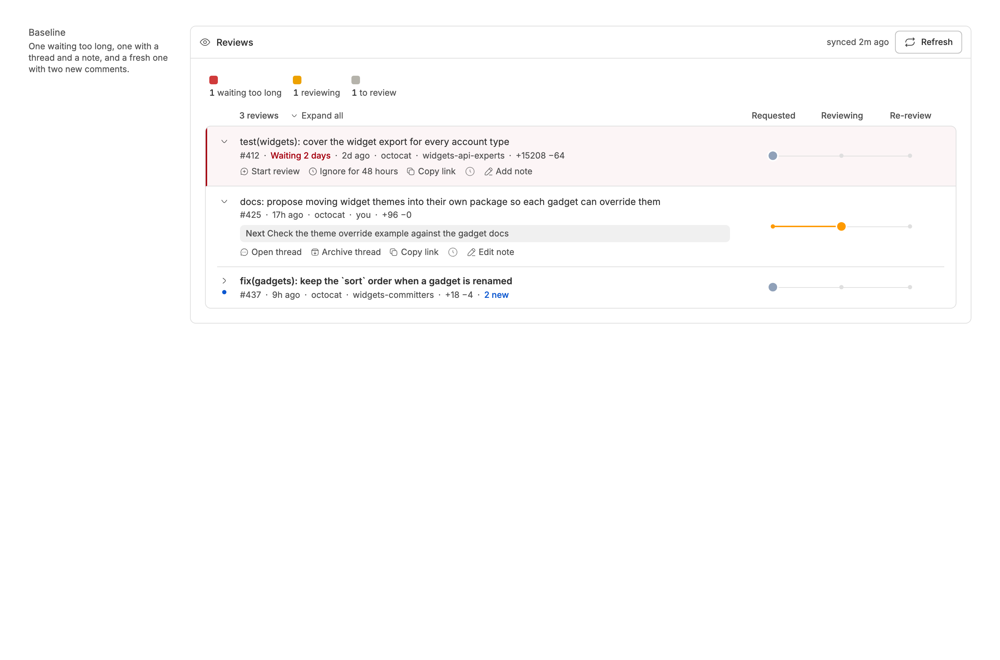
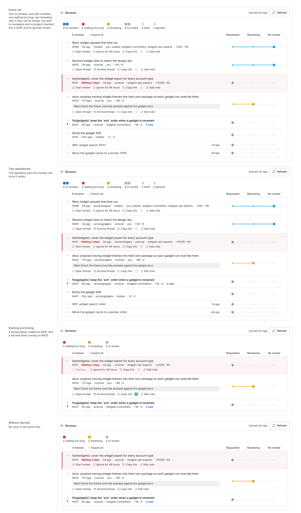
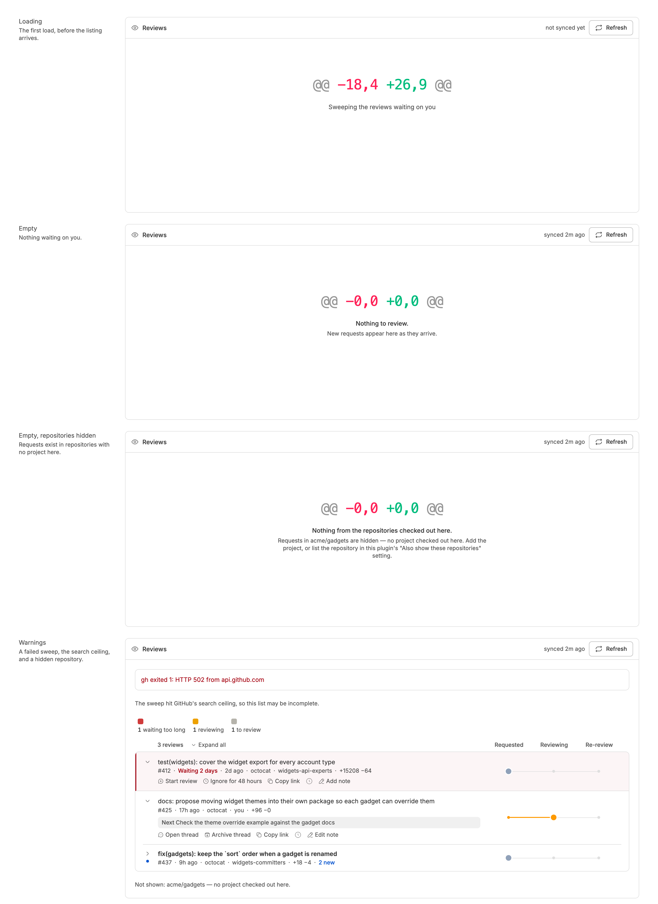
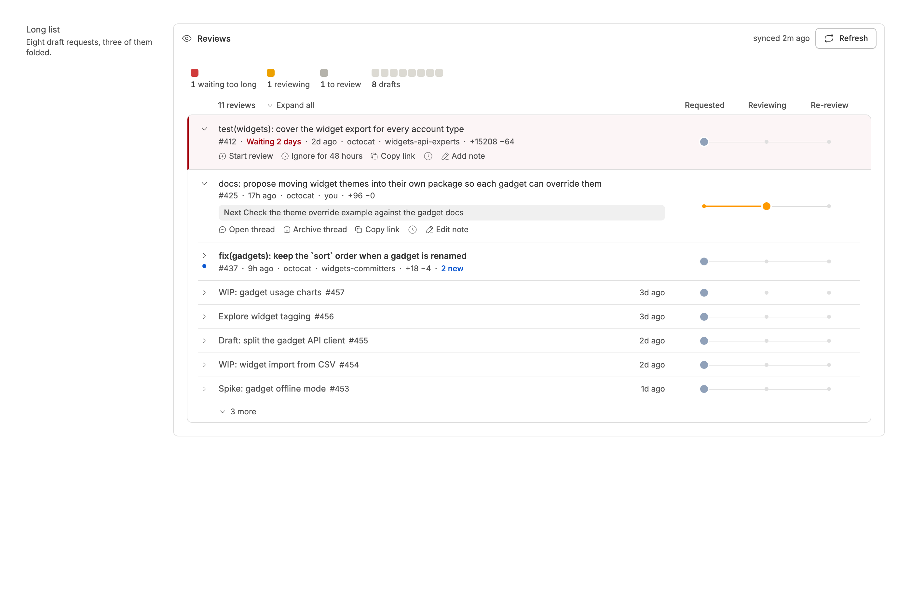

<!-- Written by `npm run screenshots` in bb-plugins. Edit the stories there, not this file. -->

# Review Sweep

Open pull requests waiting on a review from you in one list, ordered Now, Next, and Later by what needs you, oldest request first, with local notes and new comment counts. Needs gh-context.

Source: [`bb-plugin-review-sweep`](https://github.com/danielbachhuber/bb-plugins/tree/main/bb-plugin-review-sweep)

## Review list

### Baseline

A typical day. The one waited on too long and the one with a thread are open at the top; the fresh request, with two new comments, is closed to its number line.

### Rows

Every run the list can draw: re-review, waiting too long, and reviewing in Now; to review in Next; drafts and ignored in Later. Then the list across two repositories, a thread being started with a timer running, and the panel without Harvest.

### States

Loading, empty, and the notices the panel shows above and below its rows.

### Long list

A long list: the Now and Next rows at the top, then the first five Later rows, with the rest folded into "N more".

