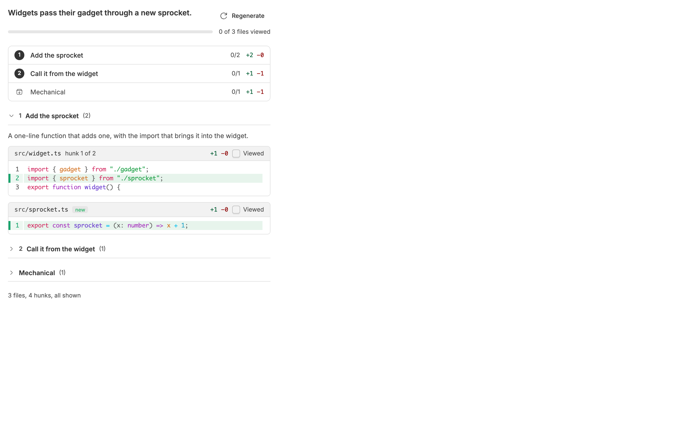
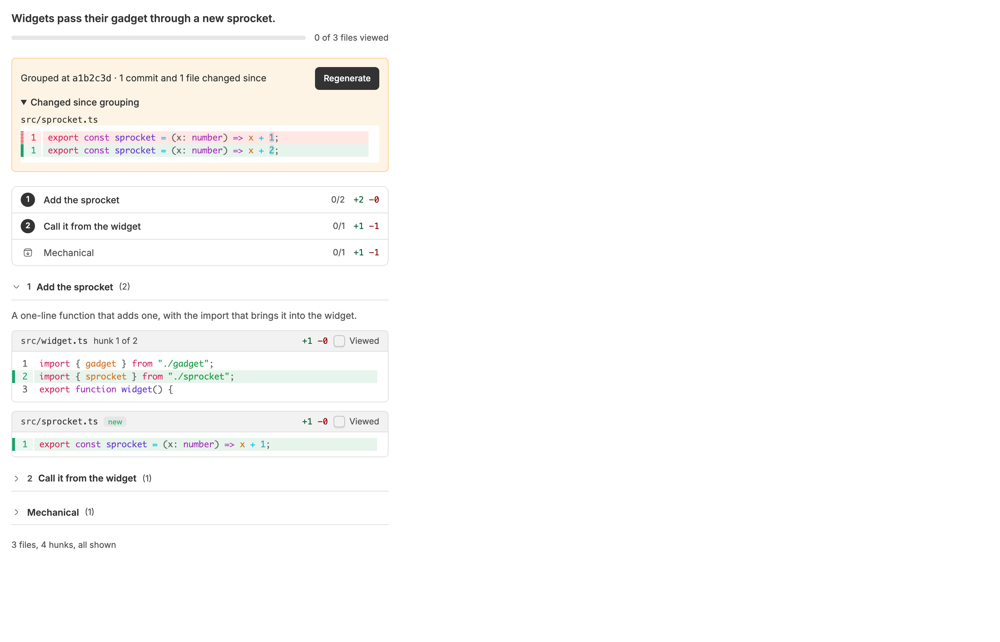
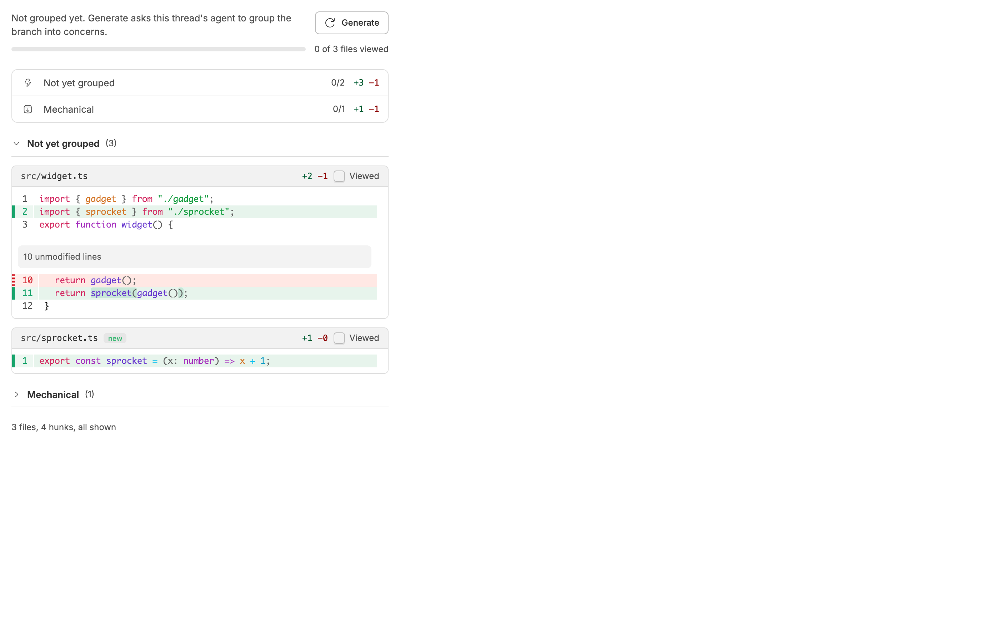
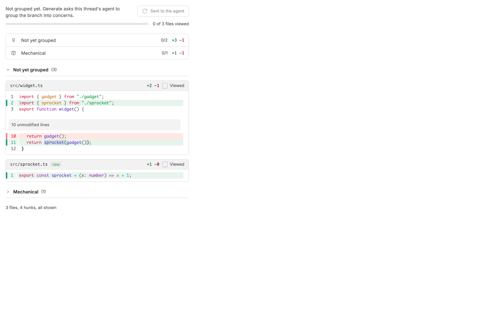
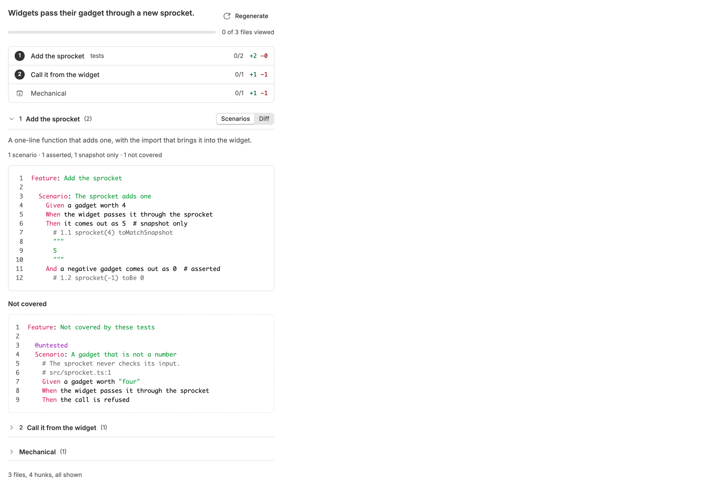
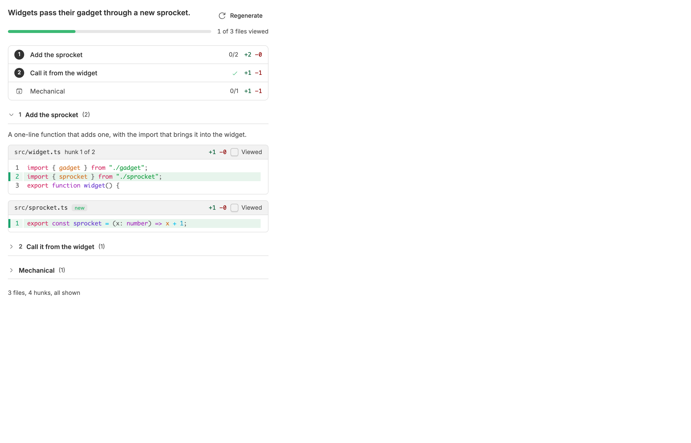

<!-- Written by `npm run screenshots` in bb-plugins. Edit the stories there, not this file. -->

# Reviewmaxx

Review a branch one concern at a time. A panel beside the thread groups every hunk on the branch into concerns, each with a summary written by the thread's agent, checks that every hunk appears exactly once, lets you mark files viewed, shows test changes as Gherkin scenarios with what they leave out, and shows exactly what changed when the branch moves on.

Source: [`bb-plugin-reviewmaxx`](https://github.com/danielbachhuber/bb-plugins/tree/main/bb-plugin-reviewmaxx)

## Review panel

### Grouped

Grouped and current: the first concern open, the lockfile set aside.

### Stale

After a commit: the banner, with exactly what changed since the grouping.

### Not grouped yet

Before any grouping: everything under Not yet grouped, with Generate.

### Generating

After Generate, while the agent works.

### Unavailable

An environment without a git checkout.

### No changes

A branch with nothing on it yet.

### Test concern

A test concern on Scenarios: what the tests check as Gherkin, each recorded value under its step, then what they leave out. Diff shows the raw files.

### Some viewed

Some files marked viewed: they fold and dim, and the bar and the outline count them.

