<!-- Written by `npm run screenshots` in bb-plugins. Edit the stories there, not this file. -->

# Super Diff

Review a branch one concern at a time. A panel beside the thread groups every hunk on the branch into concerns, each with a summary written by the thread's agent, checks that every hunk appears exactly once and that bb lists the same files, lets you check off each hunk, kept in step with GitHub's per-file Viewed or, with no pull request, Diff Viewed's, shows test changes as Gherkin scenarios with what they leave out, and shows exactly what changed when the branch moves on.

Source: [`bb-plugin-super-diff`](https://github.com/danielbachhuber/bb-plugins/tree/main/bb-plugin-super-diff)

## Review panel

### Grouped

Grouped and current: the first concern open, the lockfile set aside.

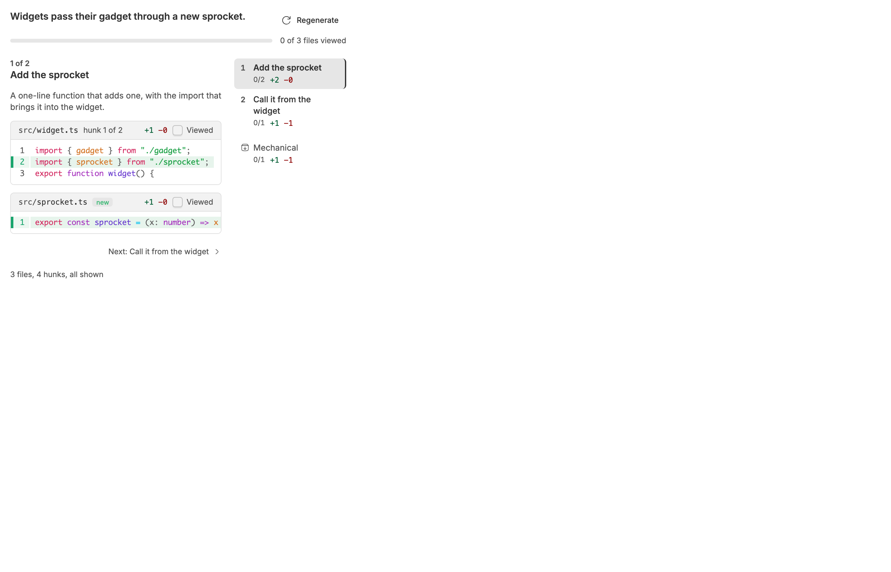

### Stale

After a commit: the banner, with exactly what changed since the grouping.

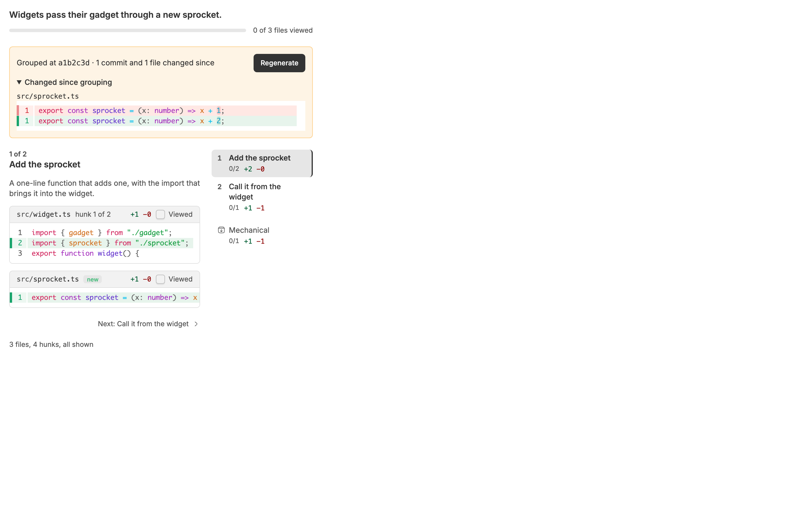

### Not grouped yet

Before any grouping: everything under Not yet grouped, with Generate.

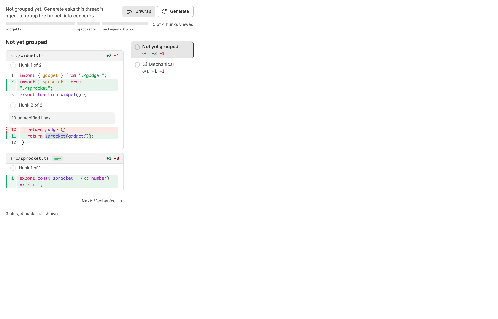

### Generating

After Generate, while the agent works.

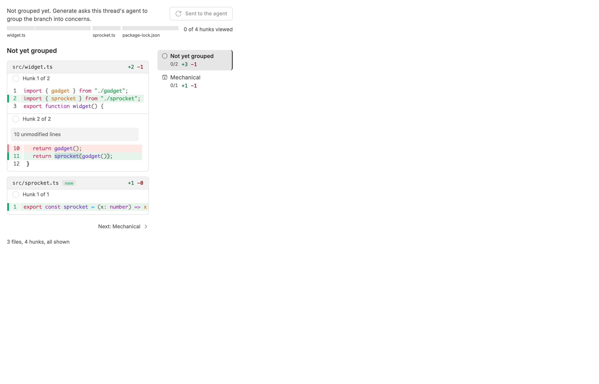

### Unavailable

An environment without a git checkout.

### No changes

A branch with nothing on it yet.

### Code and tests

A concern that changes code and tests: the code first, then its tests as scenarios under Tests, whose Scenarios and Diff toggle swaps only the test files. The rail counts its scenarios.

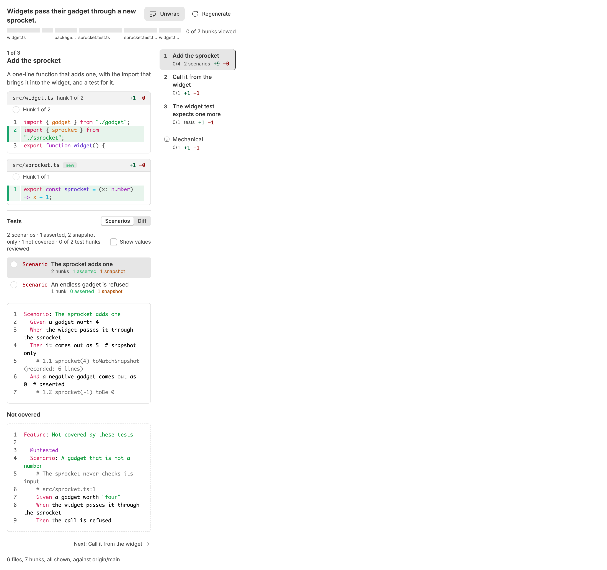

### Test concern

A concern that is only tests: its scenarios listed, the chosen one as Gherkin with recorded values folded until Show values, then what the tests leave out. Diff, beside the title, shows the raw files. The rail tags it "tests".

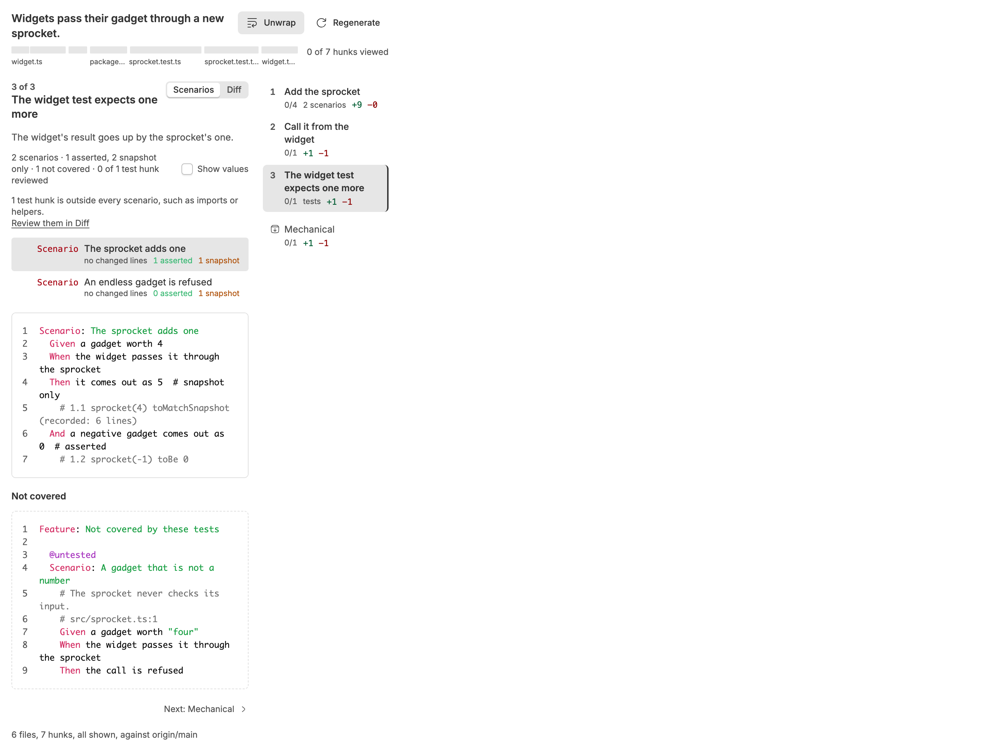

### Scenario reviewed

Each scenario has a checkmark for the test hunks behind it, and says how far through them you are. Only the snapshot is read here: the first scenario, which also covers the new test, is 1 of 2 hunks reviewed, and the second, whose test is unchanged, is reviewed.

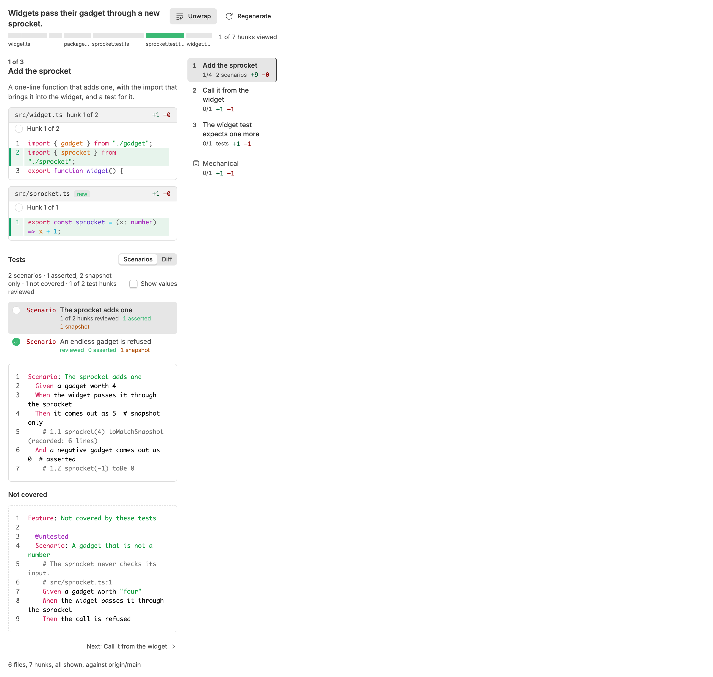

### Some viewed

Some files marked viewed: they fold and dim, and the bar and the rail count them.

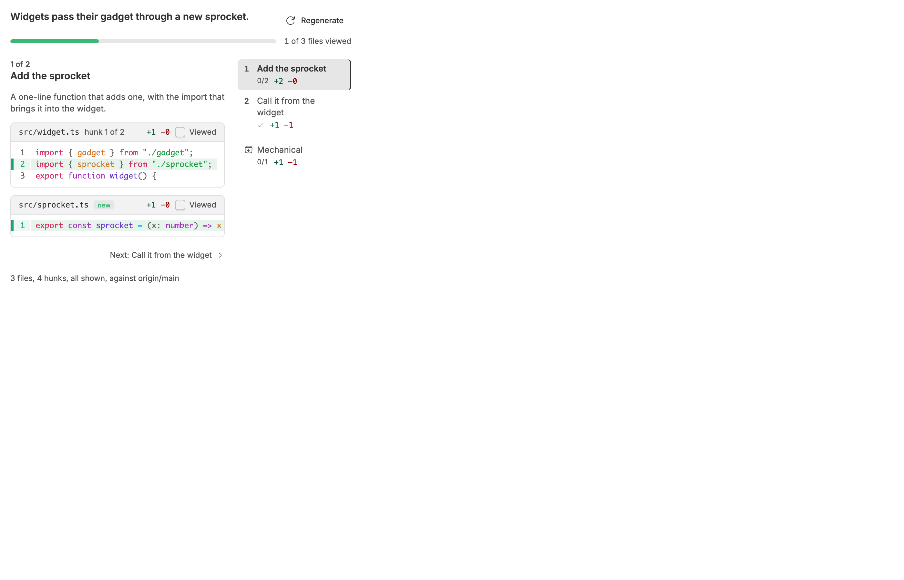

### Split file viewed in one concern

A file split across concerns, viewed in one: src/widget.ts folds in Add the sprocket, which holds its first hunk, but stays open in Call it from the widget, and the bar does not count it until both are read.

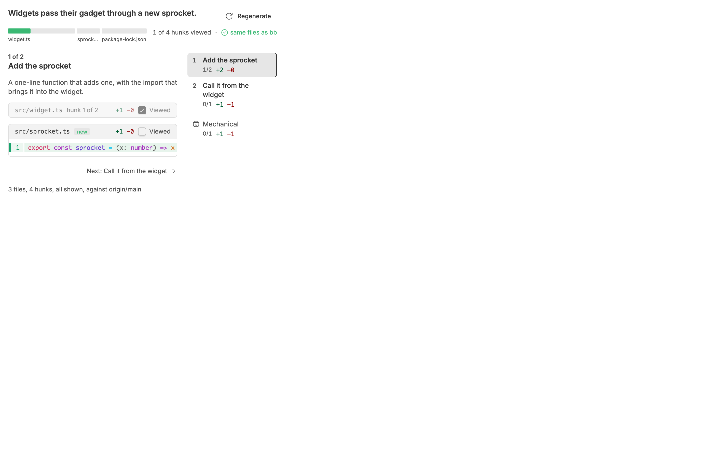

### Scenarios split one test

Scenarios that do not match the test() calls: three scenarios written from one test. A note above the list says so, and each scenario says how much of the test it covers.

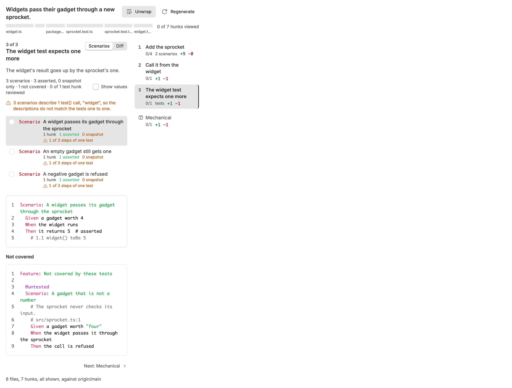

### Many files

A branch of 42 files, most of them read: too many to name one by one, so the bar groups them by directory, each named with its file count, every file still a sliver that fills as it is read.

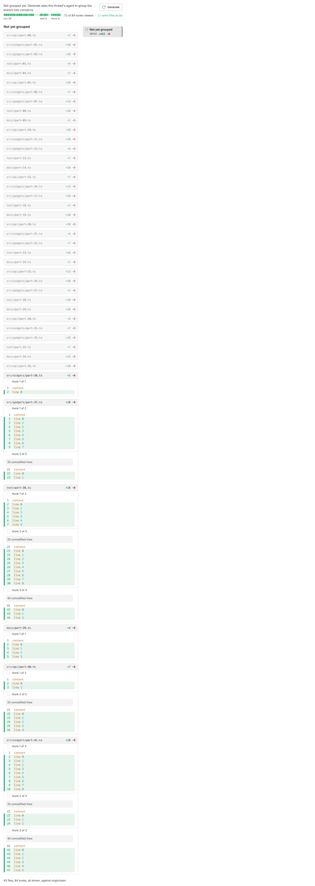

### Files differ from bb

bb's own changes panel lists a file Super Diff does not: the check beside the count turns red and names it.

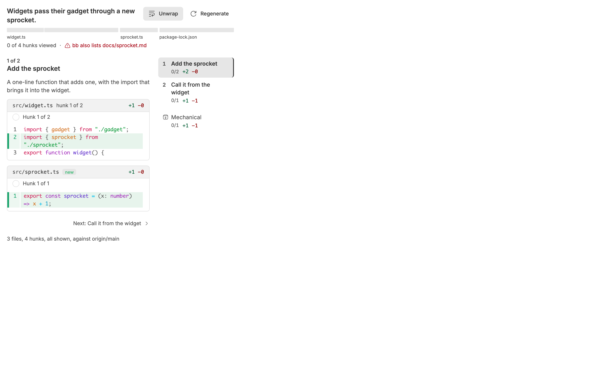

### Checks without pull request

No pull request: each hunk has a checkmark on its strip, and a read hunk folds to it. Files have no Viewed box.

### Synced one hunk read

A pull request with the same files: each file's Viewed box is GitHub's. widget.ts has its first hunk read and its second still to read, so it is not yet Viewed.

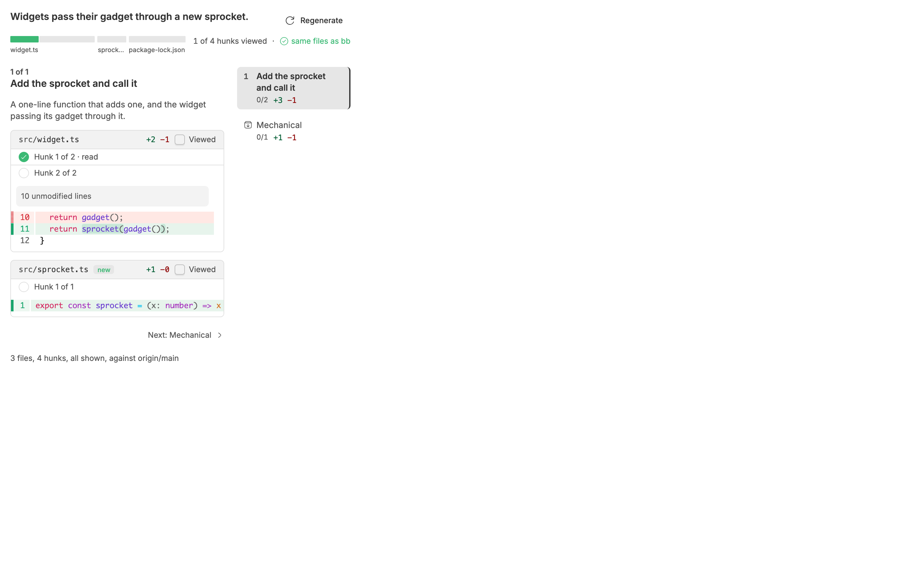

### Synced viewed on github

widget.ts is Viewed on GitHub, so every hunk of it reads as checked and its card folds.

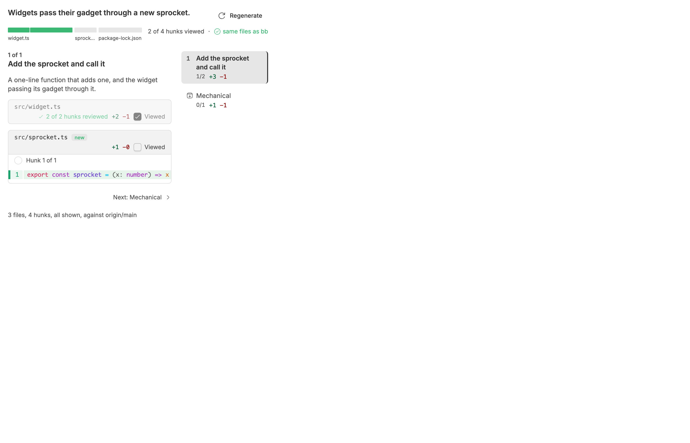

### Not on github yet

widget.ts has edits not on the pull request, so it shows "not on GitHub yet" instead of Viewed; its checkmarks stay in bb.

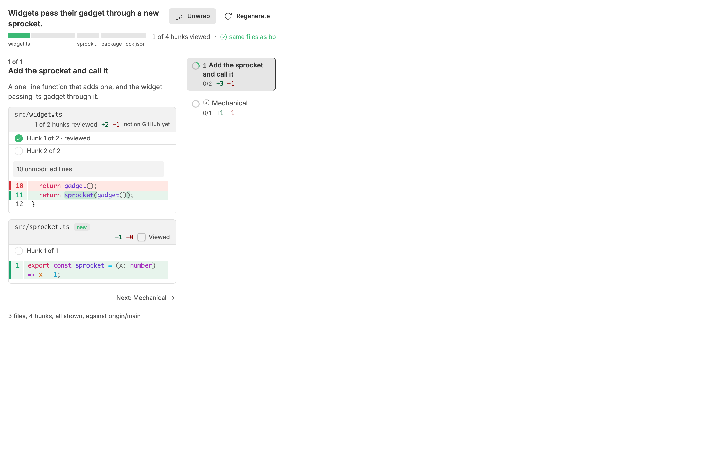
