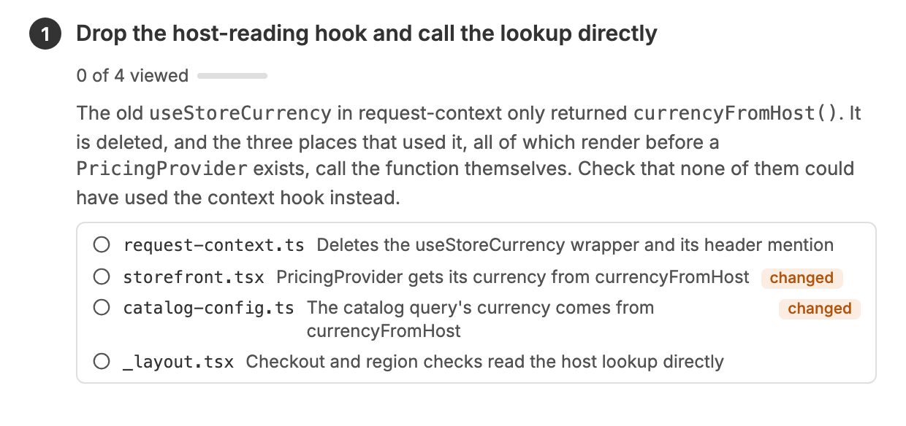
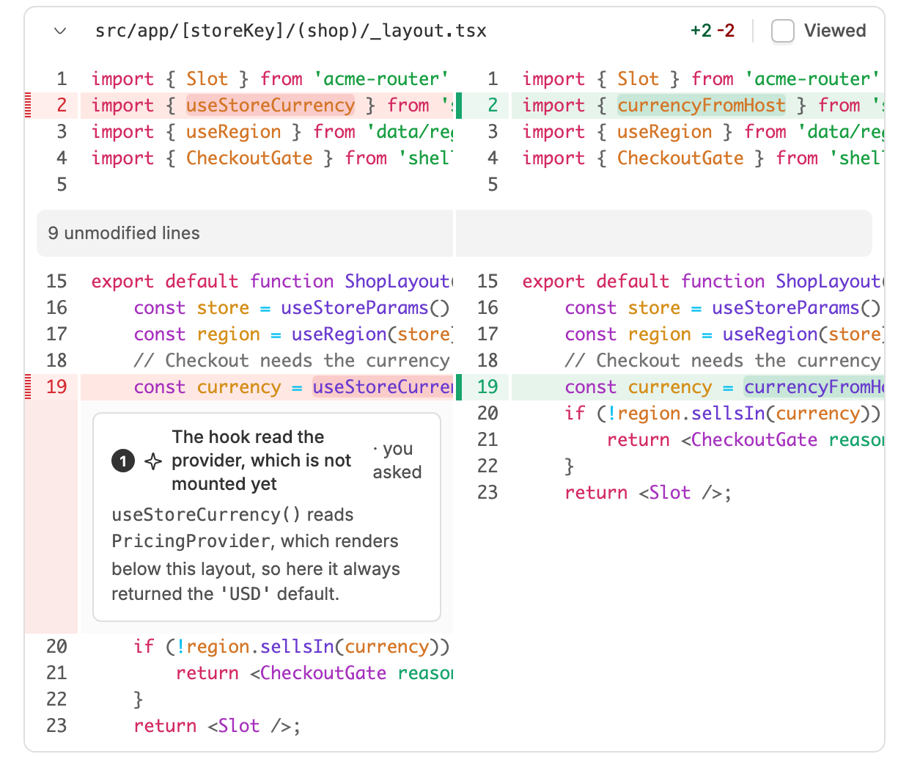

<!-- Written by `npm run screenshots` in bb-plugins. Edit the stories there, not this file. -->

# Super Diff

Group a thread's diff by concern in the Diff tab, with an explanation for each group and notes under the lines that need them.

Source: [`bb-plugin-super-diff`](https://github.com/danielbachhuber/bb-plugins/tree/main/bb-plugin-super-diff)

## Super diff

### Overview

A Super Diff of a 57-file rename: the row with every concern listed, the first concern with what each file's change is and its annotation, and one of its files in bb's diff with that annotation under the line it explains.

### All concerns

All six concerns of the same Super Diff, each with what its files' changes are, how many of them are marked viewed, and its annotations. In bb, each concern's diff cards follow its heading.

### Not generated

Before anything is generated: bb's own diff, with Generate Super Diff on the left of the row.

### No diff

The thread has no changes yet, so Generate Super Diff waits, greyed out, until it does.

### Generating

While the thread's agent reads the diff and writes the Super Diff.

### Showing super diff

A Super Diff is showing: the toggle switches back to bb's own list, the line counts what the agent wrote, and each concern is listed with how many of its files are viewed. Clicking one jumps to it; the one at the top of the list is highlighted.

### Out of date

Two files have joined the diff and two have been edited since the Super Diff was written, so the row turns amber and offers Regenerate, and the concern with edited files says how many.

### Changed files

A concern whose files were edited after the Super Diff was written: each one is marked changed, since its summary may no longer be right.

### Annotation list

A concern's annotations, under its file list: each one's number, title, and line, which jumps to its card. One note's line has left the diff.

### Annotation card

A note card as it sits under the line it explains, inside the diff.

### Explain this

Explain this: the card under a line while a fork of the thread writes its note, and the note once it is written, marked as one you asked for.

### Removed line note

A note on a removed line sits under that line, in red, rather than under the line that replaced it. Explain this works on removed lines too.

### Removed line note split

The same note in split view: it sits in the left half, under the removed line, and the right half gets a blank row so the two stay level.

### Concern file list

A concern's heading: its viewed count, then each file and what its change does. Files that change the same mechanical way share one line.

