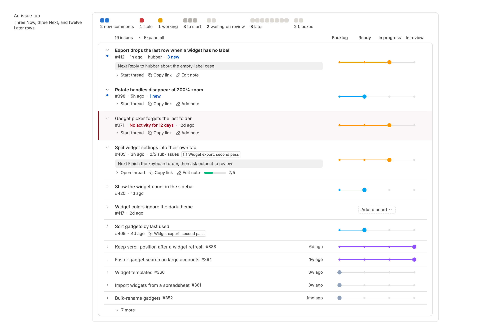
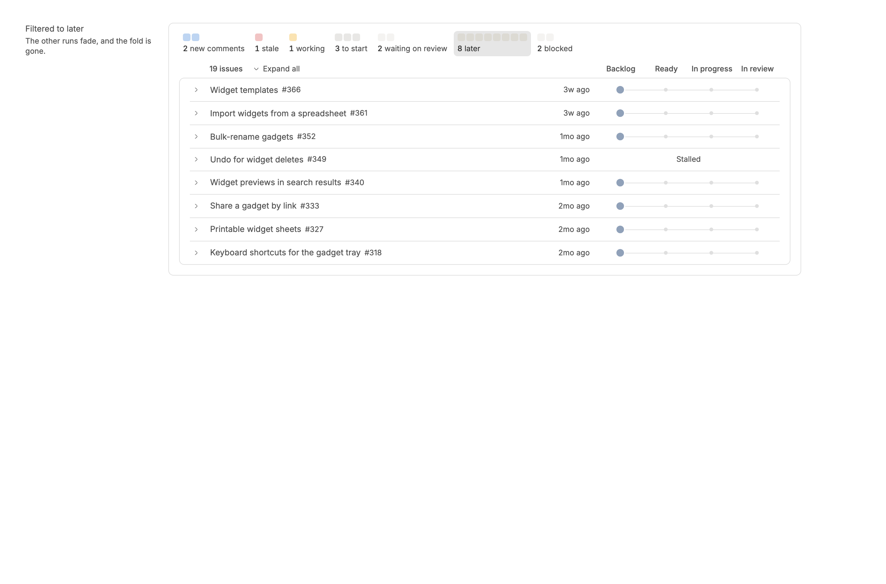
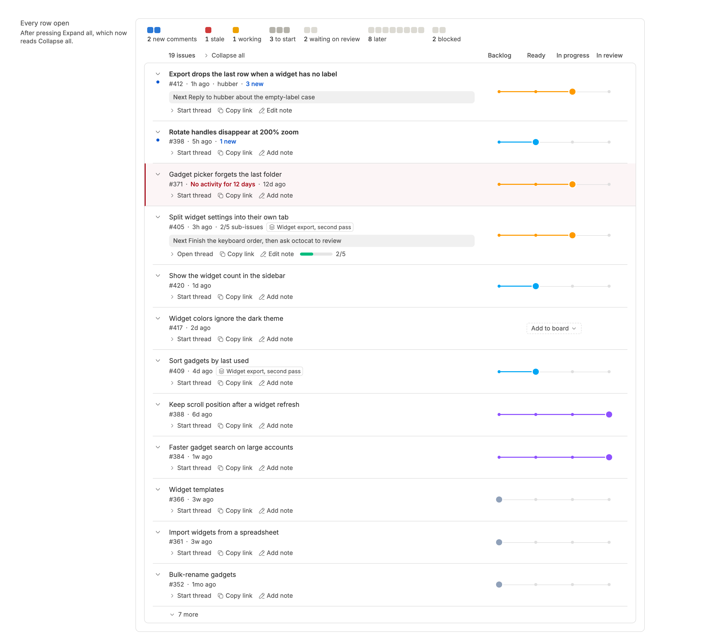

<!-- Written by `npm run screenshots` in bb-plugins. Edit the stories there, not this file. -->

# sweep-ui

The list Issue Sweep, PR Sweep, and Review Sweep draw each tab with: summary squares, rows ordered Now, Next, and Later, and a stage track.

Source: [`sweep-ui`](https://github.com/danielbachhuber/bb-plugins/tree/main/sweep-ui)

## Sweep list

### List

Now rows open, Next rows closed to their number line, and Later rows one line each, folded after five.

### Filtered

Pressing a run's squares leaves only its rows, and every Later row in it shows.

### Expanded

"Expand all" opens every row, with its note and action line.

