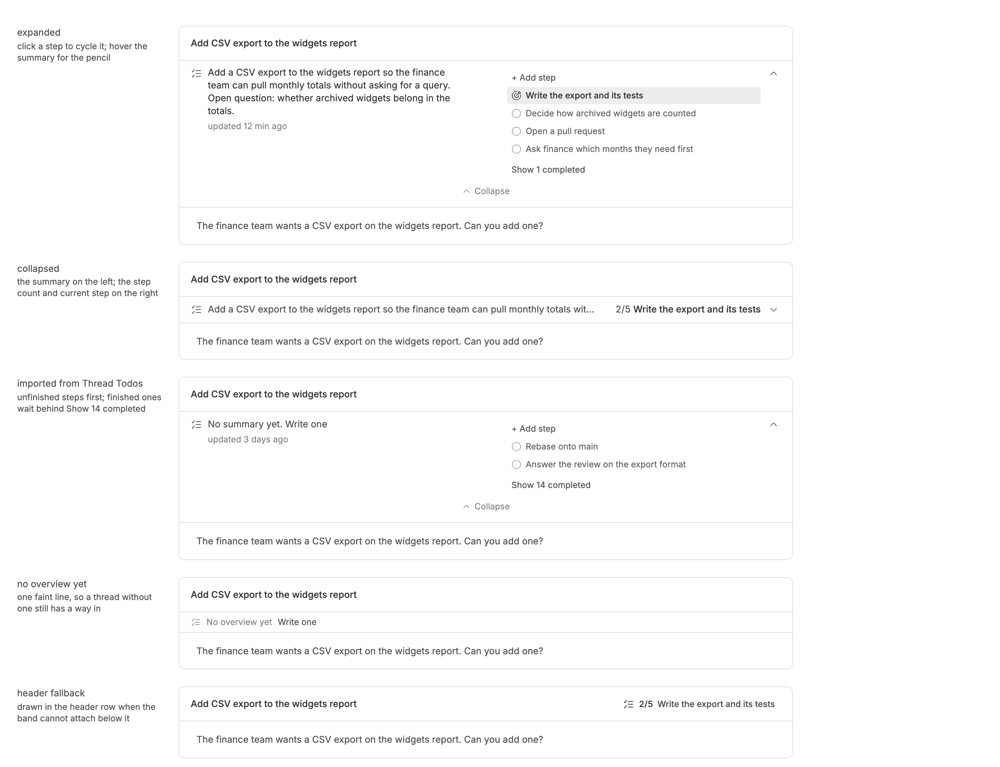

<!-- Written by `npm run screenshots` in bb-plugins. Edit the stories there, not this file. -->

# Thread Overview

A band under each thread's header saying what the thread is for, what has been done so far, and which step it is on, written by the agent as it works and edited by you in place.

Source: [`bb-plugin-thread-overview`](https://github.com/danielbachhuber/bb-plugins/tree/main/bb-plugin-thread-overview)

## Band

### States

