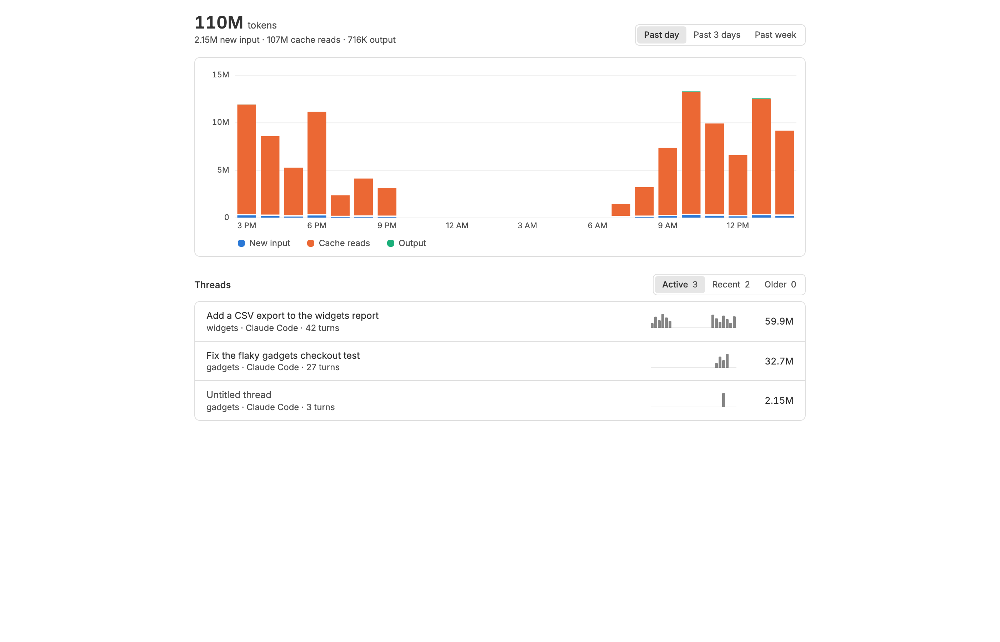
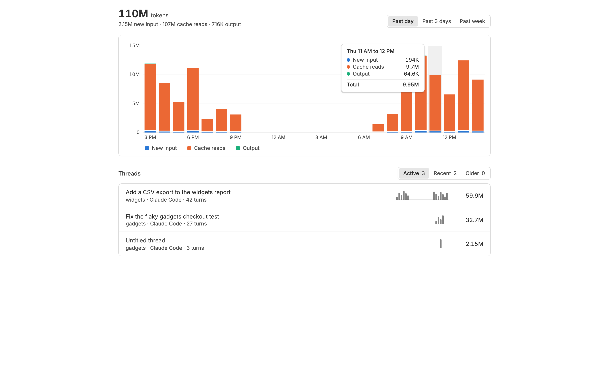
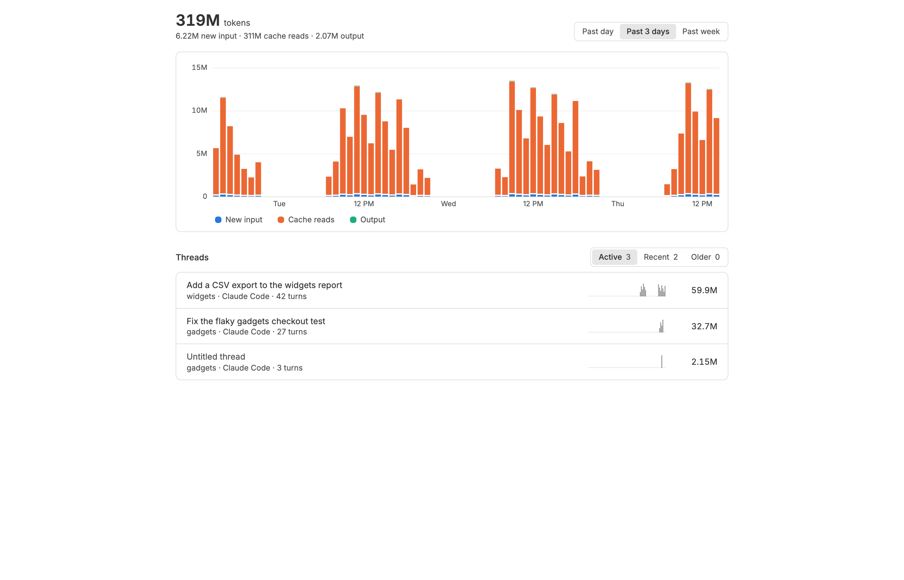
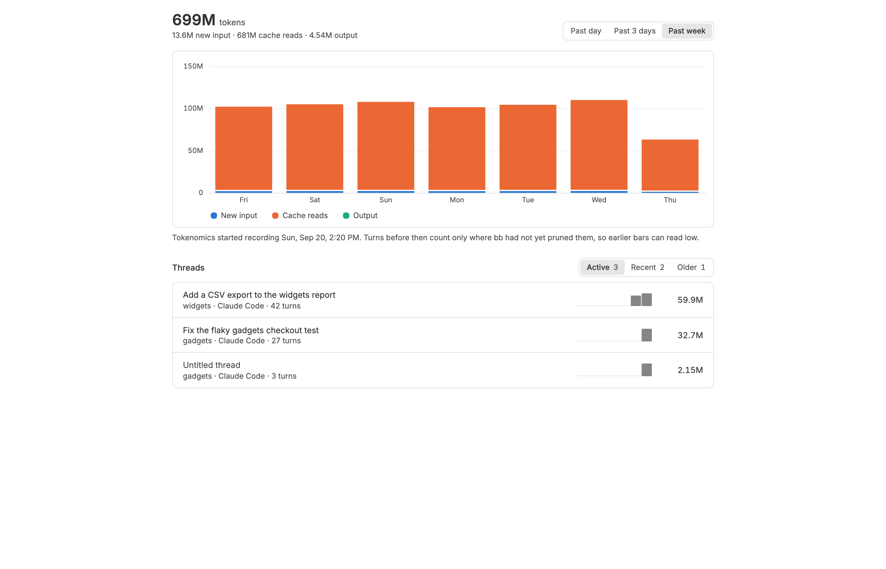
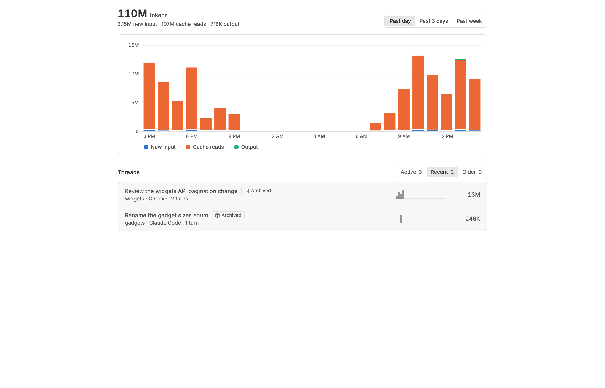
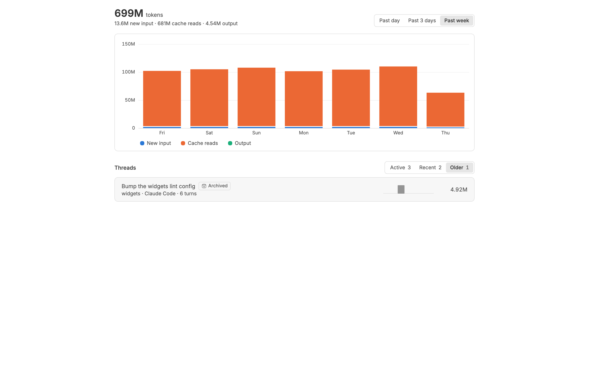
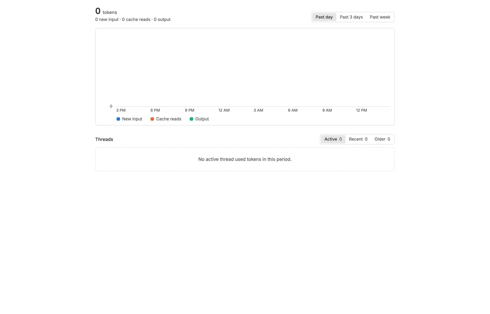
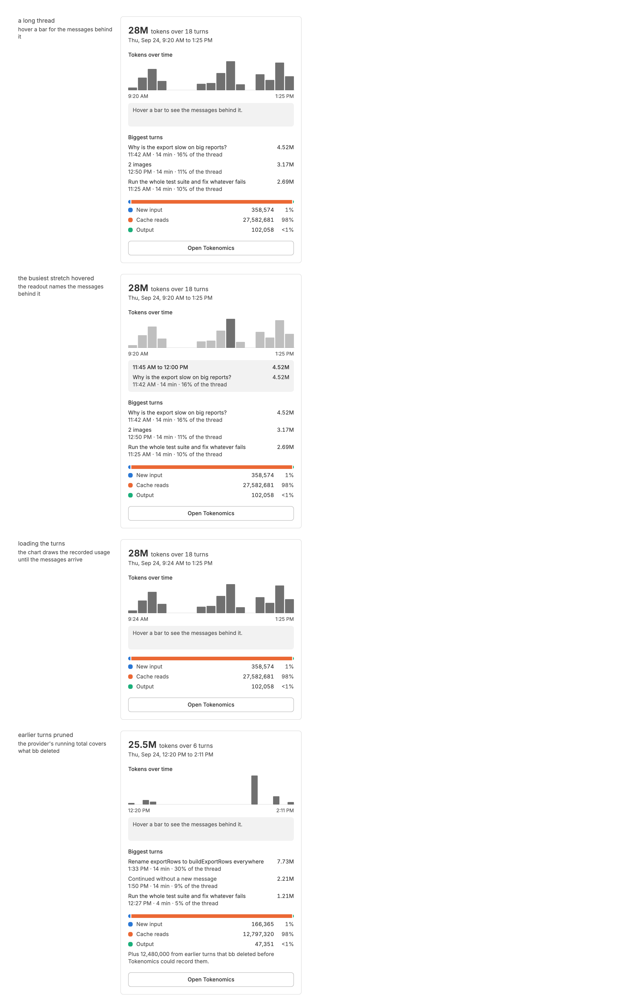
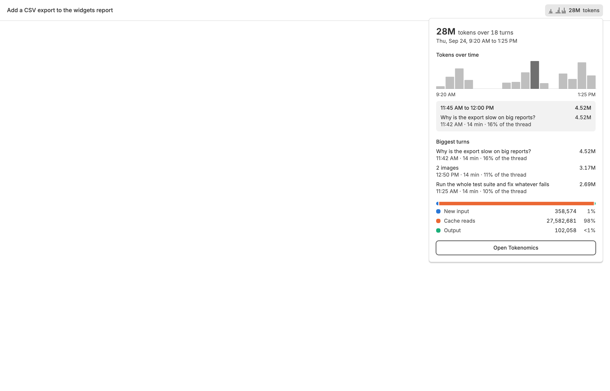

<!-- Written by `npm run screenshots` in bb-plugins. Edit the stories there, not this file. -->

# Tokenomics

Graphs how many tokens your threads used over the past day, three days, or week, lists each thread's share, and puts a sparkline of each thread's token use over time in its header that opens a summary of which of your messages used the most.

Source: [`bb-plugin-tokenomics`](https://github.com/danielbachhuber/bb-plugins/tree/main/bb-plugin-tokenomics)

## Page

### Past day

### Past day hovered

The past day with a busy hour hovered, so its tooltip shows.

### Past three days

### Past week

### Recent threads

Threads archived in the past three days, dimmed and labeled Archived.

### Older threads

Over the past week, a thread archived more than three days ago lists under Older.

### Empty

### Header count

### Header summary

The popover's contents, drawn open.

### Header open

The button where bb draws it, in a thread header's action row, with its summary open on the busiest stretch.

