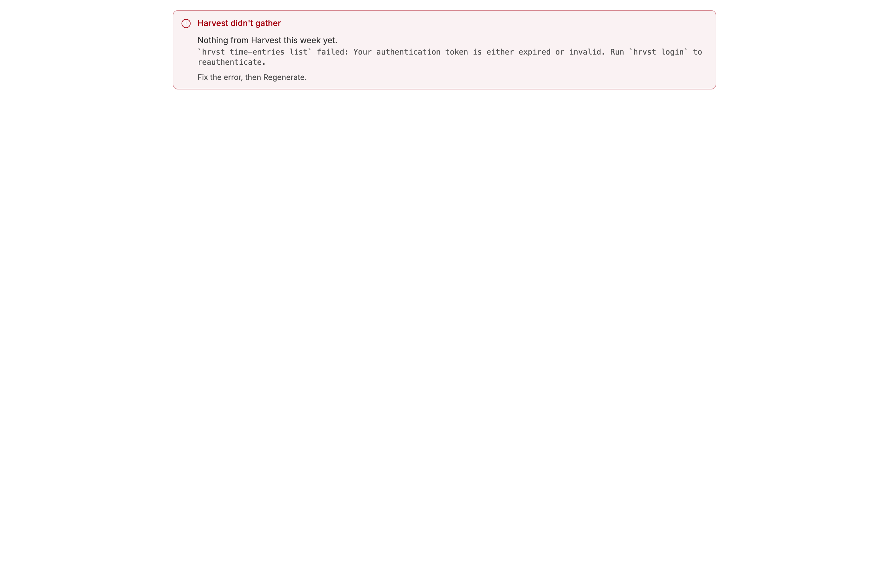
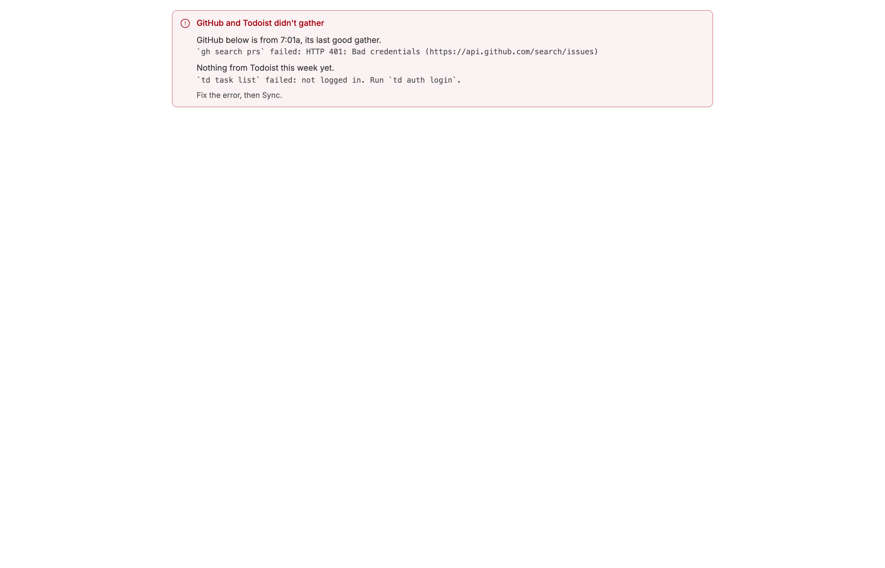
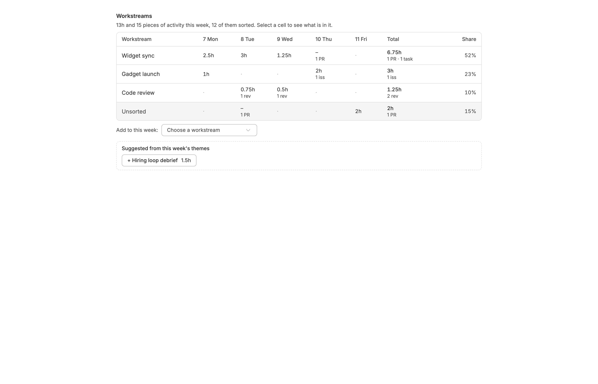
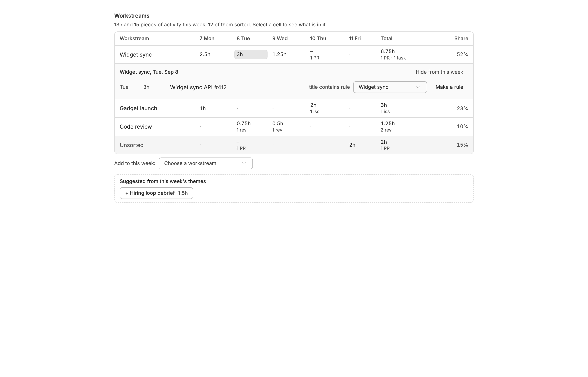
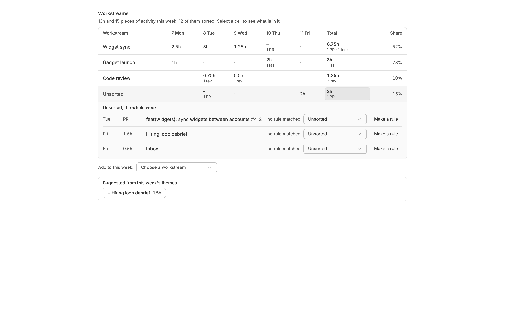
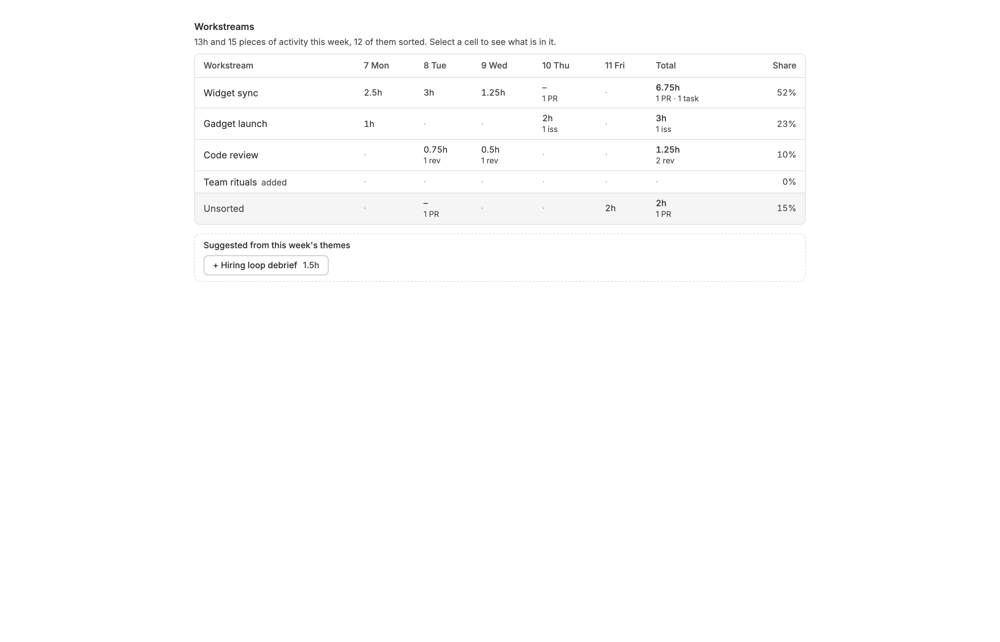

<!-- Written by `npm run screenshots` in bb-plugins. Edit the stories there, not this file. -->

# Weekly Review

One page of what you actually did this week, gathered at 7am and 1pm on weekdays and sorted into workstreams by rules you refine, to write the journal entry from.

Source: [`bb-plugin-weekly-review`](https://github.com/danielbachhuber/bb-plugins/tree/main/bb-plugin-weekly-review)

## Failurebanner

### Never gathered

One source has never gathered this week, so the page has nothing from it.

### Two sources

Two sources failed on the latest run. One is showing this morning's data; the other has nothing yet.

## Workstreams

### Week

A week sorted into three workstreams, with what the rules missed in Unsorted and a theme suggested as a fourth.

### Cell open

Tuesday's Widget sync cell, opened to list what is in it and which rule put it there.

### Unsorted

Unsorted opened: each activity can be assigned by hand or turned into a rule.

### Added empty

Team rituals added to a week it had no activity in, so its empty row shows.

